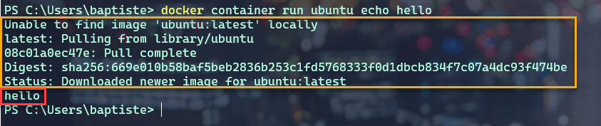
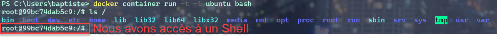
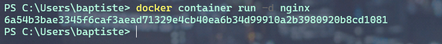
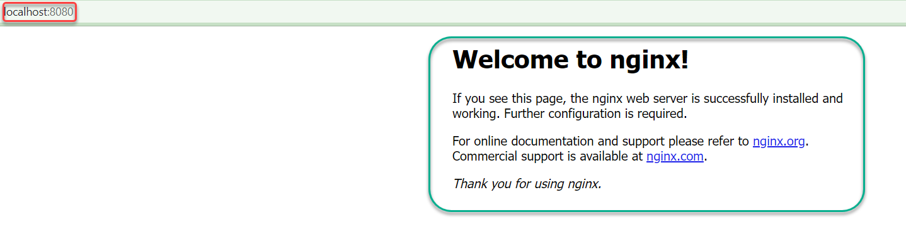
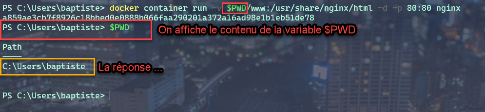
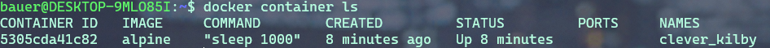
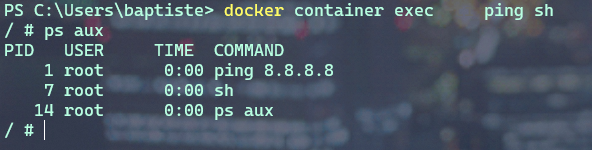

ifndef::_main_loaded[]
include::../config/load_attributes.adoc[]
endif::_main_loaded[]
//titre de la section
[[containers_avec_docker]]
= Les containers avec Docker
ifndef::_main_loaded[]
include::../config/header_attributes.adoc[]
endif::_main_loaded[]

Après avoir présenté la *plateforme Docker*, nous allons voir comment créer *des conteneurs* en ligne de commande afin de lancer des services en tâche de fond et/ou rendre disponible des repertoires de la *machine hôte* dedans.

Nous verrons comment lancer un conteneur dans un mode d’*accès privilégié*, ainsi que les commandes de bases pour la gestion de son cycle de vie.

Avant la *1.13*, lancer un *conteneur* s’effectuait avec la commande : `Docker Run` sans le mot clé `container`.

Il est toujours possible de le faire.
Mais maintenant les commandes ont été regroupées aux composant auquel elles se rapportent. C’est la raison pour laquelle le mot clé `container` a été rajouté pour les commandes relatives à la gestion du conteneur.

`docker container run [OPTIONS] IMAGE [COMMAND] [ARG]`

D’autres groupes de commande existent et nous les étudierons plus tard.

== Hello World

Lançons notre premier container *Hello-World*.

image::../images/image62.png[][]

Ouvrez un *terminal* et tapez :

[source, bash]
----
  docker container run hello-world
----

image::../images/image63.png[][]

Le client demande au `daemon` (_processus_) de lancer un *conteneur* basé sur l’image `Hello-World`.

Cette image, n’étant pas disponible en local, est téléchargée et le *processus* présent dans cette image est automatiquement exécuté.

Et dans le cas de notre `Hello-world`, il s’agit seulement d’écrire du texte sur la sortie standard : *Hello from Docker* suivi d’un texte.

Cet exemple est simple, mais il met en avant le mécanisme sous-adjacent.
À la fin du texte, on nous demande d’essayer un exemple plus ambitieux, c’est ce que nous allons faire par la suite.

[.activiy]
****
**Activité {counter:activiy} **:
Expérimentez la commande sur votre machine :

[source, javascript]
----
docker container run hello-world
----
****

## Ubuntu sous docker

Nous pouvons lancer un autre conteneur basé sur l’image d'*Ubuntu* et lui demander d’afficher `Hello` dans  le contexte de cette image.

[source, bash]
----
docker container run ubuntu echo hello
----

[.activiy]
****
*Activité {counter:activiy} :*
Analyser le contenu des cadres ci-dessus.
A quelles actions correspondent-ils ?
****

## Un containeur dans un mode intéractif

Le mode *intéractif* permet d’avoir accès à un `shell` depuis le client local  qui tourne dans le *contexte du conteneur*.

Pour cela il faut rajouter *deux options* à notre commande :

[TIP]
====
`-t` qui permet d’allouer un pseudo terminal à notre container.

`-i` qui va permettre de laisser l’entrée standard du container ouverte.
====

Nous allons utiliser l’image *Ubuntu* qui contient les binaires et les bibliothèques du système d’exploitation *Ubuntu*.

Le processus du *conteneur* dans le *système de fichier* qui est amené par le système *Ubuntu*.

[source, javascript]
----
  docker container run -t -i ubuntu bash
----
ou
[source, javascript]
----
  docker container run -ti ubuntu bash
----

Résultat :

Nous voyons que nous avons accès à un `shell` ( _coquille_ en anglais soit _interface système_ dans le jargon informatique).

Nous reconnaissons sans peine le Prompt *Ubuntu/Linux* dans lequel nous pouvons écrire par exemple une commande Linux : `ls`

[.activiy]
****
*Activité {counter:activiy} :*

Tapez dans le `shell`, la commande : `cat /etc/issue`.

* Quelle information obtenez-vous ?
****

Pour sortir du conteneur, nous allons tuer le processus via la commande : `exit`

Nous aurions pu faire la même chose en utilisant une autre image que celle d’Ubuntu.

Lançons par exemple un conteneur basé sur la distribution *Linux Alpine* qui est distribution légère et sécurisée.

[source, javascript]
----
  docker container run -t -i alpine
----
ou
[source, javascript]
----
  docker container run -ti alpine

----

image::../images/image13.png[]

Vous savez maintenant lancer un `shell` interactif dans un conteneur.

[NOTE]
====
Quand un *conteneur* est lancé seulement avec la commande `docker container run`, il est exécuté par défaut en `foreground`, mais si l’on veut l’exécuter en `background`, c’est-à-dire, en tâche de fond, il faudra utiliser l’option `-d` et la commande retournera alors l’*identifiant* du conteneur que l’on pourra utiliser par la suite pour effectuer différentes actions.
====

Par exemple nous pouvons lancer un conteneur basé sur l’image `nginx`, un *serveur http*.

.Container NGINX en *foreground*
====

Le conteneur est lancé et occupe notre console. Nous n'avons plus la main.
[source, javascript]
----
  docker container run nginx
----

image::../images/image14.png[]
====

.Container NGINX en *background*
====
Le conteneur est lancé et nous récupérons la main sur la console.

[source, javascript]
----
docker container run -d nginx
----

*NGINX* tourne en tâche de fond et nous pourrons accéder à ce conteneur par la suite grâce à son *identifiant*.
====

[NOTE]
====
Nous pourrions aussi accéder à ce serveur web depuis un *navigateur*.
Cela n'est actuellement pas possible car nous n’avons pas publié de *port*.
====

## Publication de port.

La publication d'un port est utilisée pour qu’un *conteneur* puisse être accessible depuis l’extérieur.
Afin de publier un port nous utilisons l’option `-p HOST_PORT:CONTAINER_PORT`.

Cela permet de publier un *port du conteneur* sur un *port de la machine hôte*.

L’option `-P` quant à elle laisse le choix du port au `docker démon`.

Reprenons notre conteneur *NGINX* qui est un serveur *http*.
Par défaut, *NGINX* est un processus qui se lance sur le *port 80* dans le conteneur.

Si nous souhaitons accéder à notre conteneur depuis *un navigateur de la machine hôte* sur le *port 8080* de la machine hôte,
nous lançerons le conteneur *nginx* avec la commande suivante :

[source, javascript]
----
docker container run -d -p 8080:80 nginx
----

image::../images/image16.png[]

Maintenant, nous pouvons ouvrir notre navigateur sur l'adresse : http://localhost:8080

## Bind-mount

Nous allons maintenant voir comment *monter un répertoire de la machine hôte* dans un conteneur.

Cela s’effectue grâce à l’option `-v <HOST_PATH>:<CONTAINER_PATH>`

Il existe une autre notation avec l’option `--mount type=bind, src=<HOST_PATH>,dst=<CONTAINER_PATH>`

Cela permet de partager, par exemple, le code source d’un programme présent sur une *machine hôte* avec un *conteneur*
ou de monter le *socket Unix* du *daemon Docker* (`/var/run/docker.sock`) pour permettre à un conteneur de dialoguer avec le *daemon*.

### Exemple : Monter un dossier 'www'

Quand vous développez une application et que vous modifiez le code source, il peut être intéressant que cela soit pris en compte dans le conteneur.

C’est le cas lors du développement d’une *application web*.
Nos *fichiers sources* sont sur une *machine locale*, et dans *un conteneur,* nous avons un serveur *WEB* avec *NGINX* par exemple.
Nous allons alors monter le dossier `www` local dans le *conteneur*.

[source, javascript]
----
  docker container run -v $PWD/www:/usr/share/nginx/html -d -p 80:80 nginx
----

ou

[source, javascript]
----
docker container run –mount type=bind,src=$PWD/www,dst=/usr/share/nginx/html -d -p 80:80 nginx
----

`$PWD` est une variable d’environnement qui va être créé par le *SHELL* et prendra comme valeur le *chemin du répertoire courant* dans lequel la commande a été lancé.

### Exemple: Intéragir avec le Docker Daemom

Dans cet exemple nous allons voir comment lier(_bind_) `/var/run/docker.sock`.
Ce qui nous permettra d’interagir avec le `Docker Daemon` directement depuis le conteneur et cela nous donnera accès à l’ *API du Daemon*.

image::../images/image19.png[]

#### LINUX UNIQUEMENT

Créons donc un simple conteneur : avec l’image d' *Alpine*.

[source, javascript]
----
  docker container run --rm -it --name admin -v /var/run/docker.sock:/var/run/docker.sock alpine
----

Maintenant que le conteneur est monté et branché au `Docker Daemon`, nous pouvons lui envoyer des requêtes.

*Depuis le Shell*:

Installons *CURL* :

`apk add curl` pour ajouter l’utilitaire `CURL`.

Nous allons lancer une requête *http POST* sur le `Docker DAEMON` :

[source, javascript]
----
    curl -X POST –unix-socket /var/run/docker.sock -d '{"Image":"nginx:1.12.2"}' -H 'Content-Type: application/json' http://localhost/containers/create
----

Cela aura pour effet de demander au *Docker Daemon* de créer un nouveau conteneur avec l’image *NGINX version 1.12.2*.

Le paramètre `-X POST` permet d’effectuer quel type de requête `http` ?
Sous quel format sont envoyés les instructions de configuration de l’image *Docker* à créer ?

Pour lancer le conteneur depuis le conteneur *ADMIN* :

[source, javascript]
----

  curl -XPOST –unix-socket /var/run/docker.sock http://localhost/containers/6b24...283b/start
----

[.question]
**
Question {counter:question} :
Dans cette commande, à votre avis à quoi corresponde la chaine de caractère : `6b24...283b` ?
**

### Ecouter les actions demandées au Docker Daemon

Nous allons lancer un autre conteneur dans lequel le *socket* est monté.
Puis nous écouterons les actions demandées sur le *Docker Daemon*.

[NOTE]
====
*Même ceux provenant d’autre conteneur*
====

[source, javascript]
----
  docker container run –name admin -ti -v /var/run/docker.sock:/var/run/docker.sock alpine
----

[source, javascript]
----
  curl –unix-socket /var/run/docker.sock http://localhost/events

----

### Limitation des ressources

Nous avons dit que le lancement d’un *conteneur* revient en fait à exécuter un *processeur*, et par défaut, il n’y a pas de limite de consommation des ressources matériels.

Par exemple, Un conteneur pourra utiliser toute la RAM  et impacter tous les autres conteneurs qui tournent sur la même machine hôte.

Nous pouvons toutefois imposer des limites à un conteneur.

Lançons un conteneur avec l’image `estesp/hogit` qui a pour objectif de consommer de la ram.

[source, javascript]
----
docker container run --memory 32m estesp/hogit
----

Avec `--memory 32m`, nous avons fixé une limite : quand le processus aura atteint la limite de `32M` de *RAM* consommée, il sera tué par *Docker*.

Nous pouvons limiter l’utilisation du *CPU* également.

Lançons un conteneur avec l’image `progrium/stress` qui va se charger de stresser les cœurs du *CPU*.

[source, javascript]
----
docker container run -it –rm progrium/stress -–cpu 4
----

Ici les *4* cœurs du *CPU* serons utilisés car nous n’avons pas imposé de limite.

Maintenant lançons la même commande avec le flag `--cpus 0.5` pour limiter l’utilisation du *CPU à la moitié d’un cœur*. (*12%* d’utilisation)

[source, javascript]
----
docker container run -it --rm progrium/stress -–cpu 4 –-cpus 0.5
----

En utilisant la valeur du flag : `--cpus 2` , nous limitons l’utilisation à 2 cœurs seulement. (*50%* d'utilisation)

### Les droits dans un conteneur

Dans un conteneur, s’il n’est pas précisé explicitement, l’utilisateur `root` sera utilisé comme propriétaire.
L’utilisateur `root` du conteneur correspond à l’utilisateur `root` de la machine hôte.

[NOTE]
====
*Une bonne pratique* est d’utiliser un autre utilisateur pour lancer le conteneur.
====

Il y a plusieurs façons de le définir :

* Soit à la création de l’image,
* Soit en utilisant l’option `–user`,
* Soit en changeant l’utilisateur dans le processus du conteneur (`gosu`).

Lançons un conteneur basé sur l’image *Alpine* et exécutons l'instruction `sleep 10000`.

[source, javascript]
----
docker container run -d alpine sleep 10000
----

Nous allons vérifier le `owner` du processus depuis la machine hôte :

*Pour LINUX :*

[source, javascript]
----
 ps aux | grep sleep
----

*Pour WINDOWS :*

Sous Windows, nous n'avons pas accès aux commandes LINUX nativement.
Il faut utiliser les commandes Docker natives pour avoir accès aux informations liées aux processus des conteneurs par l'intermédiaire de leur identifiant ou nom et
via la commande `top`.

Récupérez l'identifiant ou le nom du conteneurs obtenue avec la commande précédente puis :

[source, javascript]
----
docker container top <identifiant ou nom du container>
----

image::../images/image74.png[]

Faisons la même manipulation, mais cette fois avec l'image officielle de *MongoDB*

.. code-block::

  docker container run -d mongo

image::../images/image75.png[]

On constate que le processus est la propriété d'un `owner` qui posséde un `UID` de *999*.
Nous verrons par la suite comme il est possible de configurer le `owner` d'un processus lors du montage de *container*.

### Des options utiles

[NOTE]
====
* `--name` qui permet de donner un nom au container.
* `--rm` pour supprimer le container quand il est stoppé.
* `--restart=on-failure` pour relancer le container en cas d’erreur.
====

### Les commandes de base avec Docker

[source, javascript]
----
docker container <command>
----

.Résumé des commandes de base avec Docker.
|===
|Commande |Description

|`run`
|Création d’un conteneur

|`ls`
|Liste des conteneurs

|`inspect`
|Détails d’un conteneur

|`logs`
|Visualisation des logs

|`exec`
|Lancement d’un processus dans un conteneur existant

|`stop`
|Arrêt d’un conteneur

|`rm`
|Suppression d’un container
|===

* La commande `ls` :

La commande `docker container ls` montre les containers qui sont en cours d’execution.

Pour lister tous les conteneurs actifs et stoppés :

[source, javascript]
----
docker container ls -a
----

Pour lister les identifiants des containers actifs et stoppés : `docker container ls -a -q`.

image::../images/image2.png[]

A partir d’un nom ou identifiant d’un container on peut l’inspecter :

image::../images/image3.png[]

La commande renvoie une multitude d’information de configuration du container.
On peut utiliser des templates (*Go Template*) pour formater les données reçues et même extraire seulement des informations nécessaires :
par exemple : *Obtenir l’IP*

.. code-block::

  docker container inspect --format '{{ .NetworkSettings.IPAddress }}' clever_kilby
* La commande `logs` :

Cette commande,nous permets de visualiser les logs d’un container ,
l’option `-f` permet de les lire en temps réel.

Créons un container sous une image *alpine* qui exécutera une commande
`ping 8.8.8.8` et qui sera nommé : *ping*

[source,]
----
docker container run --name ping -d alpine ping 8.8.8.8
----

Puis, écoutons en temps réel les *logs* du container nommé *ping*

[source,]
----
docker container logs -f ping
----

image:../images/image4.png[image]

* La commande `exec` :

Cette commande permet de lancer un processus dans un container existant
pour faire du débug par exemple. Dans ce cas nous utiliserons les
options `-t` et `-i` pour obtenir un `shell` intéractif.

*Exemple* : lançons un container qui attend 100000 secondes, et
demandons ensuite d’ouvrir un shell pour lister les processus de ce
container.

[source,]
----
docker container run -d --name debug alpine sleep 100000
----

On lance le container avec l'option `-d` pour le mettre en tâche de fond
et récupérer la main sur le terminal et on lui donne le nom `debug` pour
le manipuler facilement.

Ensuite nous utilisons la commande `exec` qui injectera dans notre
container une commande, à savoir ici, la demande d'ouverture d'un
`shell`.

[source,]
----
docker container exec -ti debug sh
----

image:../images/image5.png[image]

Sur la capture d'écran : Dans le shell, nous avons exécuté la commande
`ps aux`. Qui permet de lister les processus et leur `owner`. On
constact que le processus de *PID 1* , correspond à la commande `sleep`.
Et le processus de PID 15 correspond à notre `ps aux`.

[WARNING]
.Warning
====
Si l'on `kill` le processus de *PID 1*, le container s’arrêtera, car un
container n’est actif que tant que son processus de *PID 1* spécifié au
lancement est en cours d’exécution.
====

* La commande `stop` :

Cette commande permet de stopper un ou plusieurs containers.

[source,]
----
docker container stop <ID>
----

[source,]
----
docker container stop <NAME>
----

Nous pouvons combiner des commandes !

*Rappel :* Obtenir la liste des containers en cours d’exécution :

[source,]
----
docker container ls -q
----

Donc pour stopper les containers en cours d’exécution :

[source,]
----
docker container stop $(docker container ls -q)
----

Les containers stoppés existent toujours :

[source,]
----
docker container ls -a
----

* La commande `rm` :

Pour supprimer un container.

[source,]
----
docker container rm <ID>
docker container rm <NAME>
----

Donc, par combinaison de commande, nous pouvons supprimer définitivement
un ou plusieurs containers qui sont déjà stoppé.

[source,]
----
docker container rm $(docker container ls -aq)
----

Avec l’option `-f` nous pouvons forcer l’arrêt d’un container et le
supprimer dans la foulée.

== En pratique :

Lançons quelques containers pour pratiquer, vous devez être en mesure de
comprendre maintenant la finalité de ces 3 commandes :

[source,]
----
docker container run -d -p 80:80 --name www nginx
----

[source,]
----
docker container run -d --name ping alpine ping 8.8.8.8
----

[source,]
----
docker container run hello-world
----

Listons les containers :

image:../images/image6.png[image]

Nous voyons les 2 premiers containers avec le statut *UP*. Nous ne
voyons pas le 3 ieme container pour la simple raison qu’une fois qu’il a
effectué son action : `echo hello world` , il s’est arrêté
automatiquement. Par contre avec un : `docker container ls -a` celui-ci
est visible.

image:../images/image7.png[image]

Son statut est *exited*, indiquant qu’il n’est pas démarré.

Nous pouvons inspecter les containers et en particulier extraire une
information comme l'*adresse IP* de notre serveur web *NGINX* :

[source,]
----
docker container inspect --format '{{ .NetworkSettings.IPAddress }}' www
----

image:../images/image8.png[image]

Nous pouvons lancer une commande dans un container en cours : par
exemple nous voulons lister la liste des processus en cours dans le
container *ping* :

[source,]
----
docker container exec -ti ping sh
----

Un `shell` est alors disponible, et dedans nous pouvons taper la
commande : `ps aux`

Tapez : `exit` pour sortir du `shell`.

Stoppons les containers : *ping* et *www*

[source,]
----
docker container stop ping www
----

faites ensuite : `docker container ls`

____
Que constatez vous ? Pourquoi ?
____

Même question avec : `docker container ls -a`

Supprimons maintenant les containers créés :

`docker container rm $(docker container ls -a -q)`

== Exercices :

===Exercice 1 : Hello From Alpine

Le but de ce premier exercice est de lancer des containers basés sur
l'image *alpine*.

. Lancez un container basé sur alpine en lui fournissant la command echo
hello
. Quelles sont les étapes effectuées par le docker daemon ?
. Lancez un container basé sur alpine sans lui spécifier de commande.
Qu’observez-vous ?

=== Exercice 2 : Shell intéractif

Le but de cet exercice est lancer des containers en mode *intéractif*.

. Lancez un container basé sur alpine en mode *interactif* sans lui
spécifier de commande
. Que s’est-il passé ?
. Quelle est la commande par défaut d’un container basé sur *alpine* ?
. Naviguez dans le *système de fichiers*
. Utilisez le gestionnaire de package d’alpine (`apk`) pour ajouter un
package : `apk update` et `apk add curl`.

=== Exercice 3 : foreground / background

Le but de cet exercice est de créer des containers en *foreground* et en
*background*.

. Lancez un container basé sur alpine en lui spécifiant la commande
`ping 8.8.8.8`.
. Arrêter le container avec `CTRL-C`

Le container est t-il toujours en cours d’exécution ?

[NOTE]
.Note
====
Vous pouvez utiliser la commande `docker ps` que nous détaillerons
prochainement, et qui permet de lister les containers qui tournent sur
la machine.
====

. Lancez un container en mode interactif en lui spécifiant la commande
`ping 8.8.8.8`.
. Arrêter le container avec `CTRL-P CTRL-Q`

Le container est t-il toujours en cours d’exécution ?

. Lancez un container en *background*, toujours en lui spécifiant la
commande `ping 8.8.8.8`.

Le container est t-il toujours en cours d’exécution ?

=== Exercice 4 : Publication de port

Le but de cet exercice est de créer un container *en exposant un port*
sur la machine *hôte*.

. Lancez un container basé sur `nginx` et publiez le `port 80` du
container sur le `port 8080` de l’hôte.
. Vérifiez depuis votre navigateur que la page par défaut de `nginx` est
servie sur `http://localhost:8080`.
. Lancez un second container en publiant le même port.

Qu’observez-vous ?

=== Exercice 5 : Liste des containers

Le but de cet exercice est de montrer les différentes options pour
lister les containers du système.

. Listez les containers en cours d’exécution.

Est ce que tous les containers que vous avez créés sont listés ?

. Utilisez l’option `-a` pour voir également les containers qui ont été
stoppés.
. Utilisez l’option `-q` pour ne lister que les IDs des containers (en
cours d’exécution ou stoppés).

=== Exercice 6 : Inspection d'un container

Le but de cet exercice est l'inspection d’un container.

. Lancez, en *background*, un nouveau container basé sur *nginx* en
publiant le *port 80* du container sur le *port 3000* de la machine
host.

Notez l'identifiant du container retourné par la commande précédente.

. Inspectez le container en utilisant son identifiant.
. En utilisant le *format Go template*, récupérez le nom et l'*IP* du
container.
. Manipuler les *Go template* pour récupérer d'autres information.

=== Exercice 7 : exec dans un container

Le but de cet exercice est de montrer comment lancer un processus dans
un container existant.

. Lancez un container en background, basé sur l'image alpine. Spécifiez
la commande `ping 8.8.8.8` et le nom ping avec l’option `--name`.
. Observez les logs du container en utilisant l'ID retourné par la
commande précédente ou bien le nom du container.

Quittez la commande de logs avec `CTRL-C`.

. Lancez un shell `sh`, en mode *interactif*, dans le container
précédent.
. Listez les processus du container.

Qu'observez vous par rapport aux identifiants des processus ?

=== Exercice 8 : cleanup

Le but de cet exercice est de stopper et de supprimer les containers
existants.

. Listez tous les containers (*actifs* et *inactifs*)
. Stoppez tous les containers encore actifs en fournissant la liste des
IDs à la commande `stop`.
. Vérifiez qu’il n’y a plus de containers actifs.
. Listez les containers arrêtés.
. Supprimez tous les containers.
. Vérifiez qu’il n’y a plus de containers.

== En résumé

Nous avons commencé à jouer avec les containers et vu les commandes les
plus utilisées pour la gestion du cycle de vie des containers (`run`,
`exec`, `ls`, `rm`, `inspect`). Nous les utiliserons souvent dans la
suite du cours.

C'est parfois utile d’avoir un `Shell` directement sur la machine hôte.
C'est-à-dire la machine sur laquelle le `Docker Daemon` tourne. Si l'on
est sur `linux`, le client et le `daemon` tournent sur la *même
machine.* Par contre le `docker daemon` va tourner sur une *machine
virtuelle* sous Windows alors que le client sera lui sur une machine
locale.
