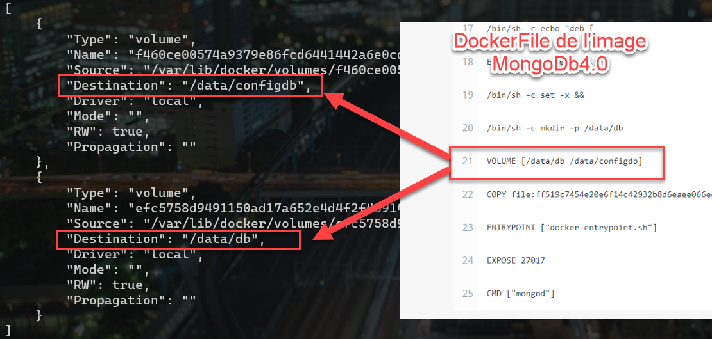
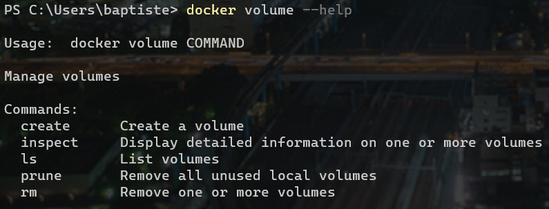
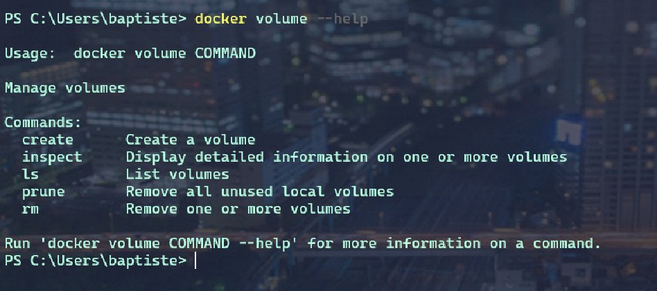
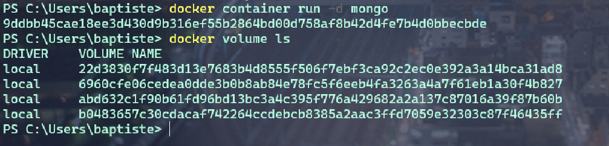
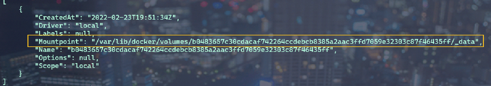
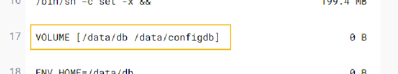
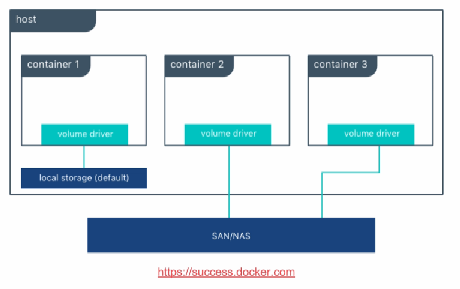
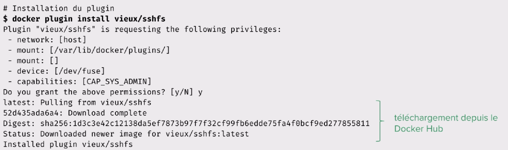
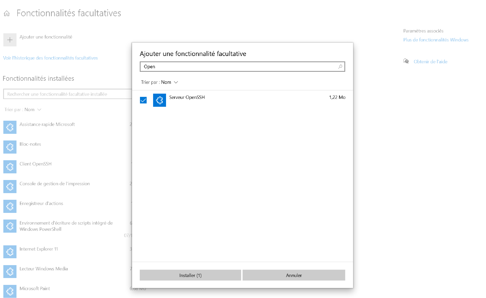

ifndef::_main_loaded[]
include::../config/load_attributes.adoc[]
endif::_main_loaded[]
//titre de la section
[[stockage_docker]]
= Stockage
ifndef::_main_loaded[]
include::../config/header_attributes.adoc[]
endif::_main_loaded[]

Dans ce chapitre nous verrons comment une application peut persister ses
données au sein d'un container.

== Volume

Si un processus modifie ou créé un fichier , cette modification sera
enregistrée dans le layer du container. Pour rappel, cette layer est
créé au lancement du container et est en lecture/écriture. Elle est
superposée aux layers qui sont en lecture de l'image.

Quand le container est supprimé, cette layer et tout les fichiers
qu'elle contient sont également supprimés.

Donc pour persister des données, il faut les stocker à l'extérieur de la
layer du container de manière à ne pas dépendre de son cycle de vie.

Pour cela il va falloir monter des *volumes* pour persister des données
grâce à :

* L'instruction *VOLUME* dans le `Dockerfile`.
* L'option `-v` ou `--mount` à la création d'un container.
* La commande `docker create volume` de la CLI.

On utilise la persistance des données dans le cas de l'utilisation d'une
base de données par exemple ou des fichiers de log.

Par exemple, si nous montons une image basée sur MongoDB :

[source,]
----
docker container run -d --name mongo mongo:4.0
----

Et que nous inspectons le container :

[source,]
----
docker container inspect -f '{{json .Mounts}}' mongo | python -m json.tool
----



Nous voyons que pour chacun des volumes montés, il y a un répertoire qui
a été créé sur la machine hôte.

Si l'on supprime le container, tout les fichiers créés dans ce volume
persisteront dans la machine hôte.

Nous avons vu comment utiliser l'option `-v CONTAINER_PATH` dans les
chapitre précédent. Elle permet de créer un lien symbolique entre un
dossier de la machine hôte vers un container.

Le Docker Daemon fournit une API pour manipuler les volumes. Voici les
commandes de base :



Il est possible de créer, inspecter, lister, supprimer des volumes.
Grâce à la commande `docker volume prune`, il est possible de supprimer
les volumes qui ne sont plus utilisés afin ne libérer de la place sur la
machine hôte.

*Créons un volume nommé : db-data* :

[source,]
----
docker volume create --name db-data
----

En listant nos volumes, nous retrouvons `db-data`, et nous voyons que
c'est le driver local de Docker par défaut qui a été utilisé pour la
création de ce volume.

image:../images/image103.png[image]

Lorsque nous consultons la liste des volumes disponibles sur notre
machine hôte, nous comprenons facilement pourquoi il est interessant de
leur donner un nom. Sinon le nom sera généré automatiquement et sera
difficilement exploitable.

Et si nous inspectons ce volume :

[source,]
----
docker volume inspect db-data
----

image:../images/image104.png[image]

Nous constatons que le volume est bien monté, et que son emplacement est
autogéré par le driver `local`.

Maintenant que notre volume est créé. Nous allons pouvoir facilement le
monter dans un container grâce à son nom.

[source,]
----
docker container run -d --name db -v db-data:/data/db mongo
----


== Démo : Volume avec MongoDb

Nous allons illustrer la notion de volume dans cette partie.

Examinons les commandes à disposition pour gérer le cycle de vie des volumes :




Listons les volumes existant avec la commande : 

[source, javascript]
----
docker volume ls
----

Lançons un conteneur basé sur MongoDb

[source, javascript]
----
docker container run -d mongo
----

Puis listons de nouveaux la liste des volumes :

[source, javascript]
----
docker volume ls
----


Récupérons un identifiant de volume et inspectons le : 

[source, javascript]
----
docker inspect  b0483657c30cdacaf742264ccdebcb8385a2aac3ffd7059e32303c87f46435ff
----

La clé `Mountpoint` nous indique le répertoire dans lequel est stocké le volume sur la machine hôte, c'est-à-dire l'ensemble des bases, des collections de MongoDb par exemple.



[NOTE]
====
Les données sont toujours présentes dans la machine hôte même si le conteneur est supprimé. Car le volume est stocké dans la machine hôte.
====

Si l'on regarde le contenu du `Dockerfile` de MongoDb ( voir Docker Hub), nous constatons que deux volumes sont créés.



* **Comment créer nos propres volumes ?**

[source, javascript]
----
docker container run -d --name mongo -v <data>:/data/db mongo
----

On peut alors monter un conteneur Mongo avec des données existantes. Ainsi, les deux volumes par default ne seront pas créé lors du montage du conteneur.

[NOTE]
====
L'intérêt de créer des volumes est de pouvoir s'interfacer avec des solutions de stockage qui existent.

Par défaut, on utilise un driver "local" sur la machine hôte.
Mais l'on peut utiliser un autre driver qui pourrait nous permettre de créer un volume sur des stockages distribués ou différentes solutions.
====


== Exercice : Utilisation des volumes

Nous allons illustrer la notion de volume. Nous verrons notamment comment définir un volume:

* Dans un Dockerfile
* Au lancement d’un conteneur en utilisant l’option `-v`
* En utilisant la ligne de commande

=== Prérequis


* Installation de `jq`

Pour certaines commandes vous aurez besoin de l'utilitaire `jq` qui permet de manipuler des structures *json* très facilement. Vous pouvez l'installer depuis https://stedolan.github.io/jq/download/

* Si vous utilisez Docker for Mac ou Docker for Windows

la plateforme Docker est installée dans une machine virtuelle tournant sur un hyperviseur léger (_xhyve_ pour macOS, _Hyper-V_ pour Windows). Pour effectuer cet exercice il vous faudra utiliser la commande suivante pour accéder à un `shell` dans cette machine virtuelle.

[source, javascript]
----
$ docker run -it --privileged --pid=host debian nsenter -t 1 -m -u -n -i sh

----

Comme nous l'avons évoqué dans le cours, cette commande permet de lancer un shell dans un conteneur basé sur debian, et faire en sorte d'utiliser les namespaces de la machine hôte (la machine virtuelle) sur laquelle tourne le daemon Docker.

Une fois que vous avez lancé ce conteneur, vous pourrez naviguer dans le _filesystem_ de la machine sur laquelle tourne le daemon Docker, c'est-à-dire l'endroit où les images sont stockées.

=== Persistance des données dans un conteneur

[IMPORTANT]
====
Nous allons illustrer pourquoi, par défaut, un conteneur ne doit pas être utilisé pour persister des données.

====

En utilisant la commande suivante, lancez un shell intéractif dans un conteneur basé sur l’image `alpine:3.8`, et nommé le `c1`.

[source, javascript]
----
docker container run --name c1 -ti alpine:3.8 sh
----

Dans ce conteneur, créez le répertoire `/data` et dans celui-ci le fichier `hello.txt`.

[source, javascript]
----
mkdir /data && touch /data/hello.txt
----

Sortez ensuite du conteneur.

[source, javascript]
----
exit
----

Lors de la création du container, une *layer* `read-write` est ajoutée au-dessus des layers `read-only` de l’image sous-adjacente.

C’est dans cette *layer* que les changements que nous avons apportés dans le container ont étés persistés (création du fichier `/data/hello.txt`).

Nous allons voir comment cette *layer* est accessible depuis la machine hôte (celle sur laquelle tourne le daemon Docker) et vérifier que nos modifications sont bien présentes.
Utilisez la command `inspect` pour obtenir le path de la layer du container `c1`.

La clé qui nous intéresse est `GraphDriver`.

[source, javascript]
----
docker container inspect c1
----

Nous pouvons scroller dans l’output de la commande suivante jusqu’à la clé `GraphDriver` ou bien nous pouvons utiliser le format *Go templates* et obtenir directement le contenu de la clé.

Lancez la commande suivante pour n'obtenir que le contenu de `GraphDriver`.


[source, javascript]
----
docker container inspect -f "{{ json .GraphDriver }}" c1 | jq .
----

Vous devriez obtenir un résultat proche de celui ci-dessous.

[source, json]
----
{
  "Data": {
    "LowerDir": "/var/lib/docker/overlay2/d0ffe7...1d66-init/diff:/var/lib/docker/overlay2/acba19...b584/diff",
    "MergedDir": "/var/lib/docker/overlay2/d0ffe7...1d66/merged",
    "UpperDir": "/var/lib/docker/overlay2/d0ffe7...1d66/diff",
    "WorkDir": "/var/lib/docker/overlay2/d0ffe7...1d66/work"
  },
  "Name": "overlay2"
}
----

Avec la commande suivante, vérifiez que le fichier *hello.txt* se trouve dans le répertoire référencé par `UpperDir`.

[source, javascript]
----
CONTAINER_LAYER_PATH=$(docker container inspect -f "{{ json .GraphDriver.Data.UpperDir }}" c1 | tr -d '"')
----

[source, javascript]
----
find $CONTAINER_LAYER_PATH -name hello.txt
/var/lib/docker/overlay2/d0ffe7...1d66/diff/data/hello.txt

----

Supprimez le container `c1` et vérifiez que le répertoire spécifié par `UpperDir` n’existe plus.

[source, javascript]
----
docker container rm c1
----

[source, javascript]
----
ls $CONTAINER_LAYER_PATH

ls: cannot access '/var/lib/docker/overlay2/d0ffe7...1d66/diff': No such file or directory
----

Cela montre que les données créées dans le conteneur ne sont pas persistées et sont supprimées avec lui.

=== Définition d’un volume dans un Dockerfile

Nous allons maintenant voir comment les volumes sont utilisés pour
permetttre de remédier à ce problème et permettre de persister des
données en dehors d’un container.

Nous allons commencer par créer un Dockerfile basé sur l’image alpine et
définir /data en tant que volume. Tous les élements créés dans /data
seront persistés en dehors de l’union filesystem comme nous allons le
voir.

Créez le fichier _Dockerfile_ contenant les 2 instructions suivantes:

[source, javascript]
----
FROM alpine:3.8
VOLUME ["/data"]
----


Construisez l’image _imgvol_ à partir de ce Dockerfile.

[source, javascript]
----
$ docker image build -t imgvol .
Sending build context to Docker daemon  2.048kB
Step 1/2 : FROM alpine:3.8
 ---> 3f53bb00af94
Step 2/2 : VOLUME ["/data"]
 ---> Running in 7ee2310fca60
Removing intermediate container 7ee2310fca60
 ---> d8f6d5332181
Successfully built d8f6d5332181
Successfully tagged imgvol:latest
----

Avec la commande suivante, lancez un shell intéractif dans un container,
nommé _c2_, basé sur l’image imgvol.

....
$ docker container run --name c2 -ti imgvol
....

Depuis le container, créez le fichier _/data/hello.txt_

....
# touch /data/hello.txt
....

Sortons ensuite du container avec la commande *CTRL-P* suivie de
*CTRL-Q*, cette commande permet de passer le process en tache de fond,
elle n’arrête pas le container. Pour être sur que _c2_ tourne, il doit
apparaitre dans la liste des containers en execution. Vérifiez le avec
la commande suivante:

....
$ docker container ls
....

Utilisez la commande _inspect_ pour récuperer la clé *Mounts* afin
d’avoir le chemin d’accès du volume sur la machine hôte.

....
$ docker container inspect -f "{{ json .Mounts }}"  c2 | jq .
....

Vous devriez obtenir un résultat similaire à celui ci-dessous (aux ID
prêts).

[source, json]
----
[
  {
    "Type": "volume",
    "Name": "d071337...3896",
    "Source": "/var/lib/docker/volumes/d07133...3896/_data",
    "Destination": "/data",
    "Driver": "local",
    "Mode": "",
    "RW": true,
    "Propagation": ""
  }
]
----


Le volume _/data_ est accessible, sur la machine hôte, dans le path
spécifié par la clé *Source*.

Avec la commande suivante, vérifiez que le fichier _hello.txt_ est bien
présent sur la machine hôte.

[source, javascript]
----
VOLUME_PATH=$(docker container inspect -f "{{ (index .Mounts 0).Source }}" c2)
----


[source, javascript]
----
find $VOLUME_PATH -name hello.txt
/var/lib/docker/volumes/cb5...f49/_data/hello.txt
----

Supprimez maintenant le container _c2_.

[source, javascript]
----
docker container stop c2 && docker container rm c2
----


Vérifier que le fichier _hello.txt_ existe toujours sur le filesystem de
l’hôte.

....
$ find $VOLUME_PATH -name hello.txt
/var/lib/docker/volumes/cb5...f49/_data/hello.txt
....

Cet exemple nous montre qu’un volume permet de persister les données en
dehors de l’union filesystem et ceci indépendemment du cycle de vie d’un
container.

=== Définition d’un volume au lancement d’un container

Précédemment nous avons défini un volume dans le _Dockerfile_, nous
allons maintenant voir comment définir des volumes à l’aide de l’option
`-v` au lancement d’un container.

Lancez un container avec les caractéristiques suivantes:

- basé sur l’image _alpine:3.8_ - nommé _c3_ - exécution en background (option `-d`)
- définition de _/data_ en tant que volume (option -v) - spécification
d’une commande qui écrit dans le volume ci-dessus.

Pour ce faire, lancez la commande suivante:

[source, javascript]
----
docker container run --name c3 -d -v /data alpine sh -c 'ping 8.8.8.8 > /data/ping.txt'
----


Inspectez le container et repérez notamment le chemin d’accès du volume
sur la machine hôte.

[source, json]
----
docker inspect -f "{{ json .Mounts }}" c3 | jq .
[
  {
    "Type": "volume",
    "Name": "2ba36b...3ef2",
    "Source": "/var/lib/docker/volumes/2ba36b...3ef2/_data",
    "Destination": "/data",
    "Driver": "local",
    "Mode": "",
    "RW": true,
    "Propagation": ""
  }
]
----

Le volume est accessible via le filesystem de la machine hôte dans le
path spécifié par la clé *Source*.

En utilisant la commande suivante, vérifiez ce que ce répertoire
contient.

[source, javascript]
----
VOLUME_PATH=$(docker container inspect -f "{{ (index .Mounts 0).Source }}" c3)
----

[source, javascript]
----
tail -f $VOLUME_PATH/ping.txt
----
....
64 bytes from 8.8.8.8: seq=34 ttl=37 time=0.462 ms
64 bytes from 8.8.8.8: seq=35 ttl=37 time=0.436 ms
64 bytes from 8.8.8.8: seq=36 ttl=37 time=0.512 ms
64 bytes from 8.8.8.8: seq=37 ttl=37 time=0.487 ms
64 bytes from 8.8.8.8: seq=38 ttl=37 time=0.409 ms
64 bytes from 8.8.8.8: seq=39 ttl=37 time=0.438 ms
64 bytes from 8.8.8.8: seq=40 ttl=37 time=0.477 ms

....

Le fichier _ping.txt_ est mis à jour régulièrement par la commande ping
qui tourne dans le container.

Si nous stoppons et supprimons le container, le fichier _ping.txt_ sera
toujours disponible via le volume, cependant il ne sera plus mis à jour.

Supprimez le container _c3_ avec la commande suivante.

....
$ docker container rm -f c3
....

=== Utilisation des volumes via la CLI

[NOTE]
====

Les commandes relatives aux volumes ont été introduites dans Docker 1.9.
====

Elles permettent de manager le cycle de vie des volumes de manière très
simple.

La commande suivante liste l’ensemble des sous-commandes disponibles.

....
docker volume --help
....

La commande create permet de créer un nouveau volume. Créez un volume
nommé _html_ avec la commande suivante.

....
docker volume create --name html
....

Lister les volumes existants et vérifiez que le volume _html_ est
présent.

....
docker volume ls
....

[source, javascript]
----
DRIVER              VOLUME NAME
local               html
----


Comme pour les containers et les images (et d’autres primitives Docker),
la commande inspect permet d’avoir la vue détaillée d’un volume.
Inspectez le volume _html_

[source, ]
----
$ docker volume inspect html
[
    {
        "Driver": "local",
        "Labels": {},
        "Mountpoint": "/var/lib/docker/volumes/html/_data",
        "Name": "html",
        "Options": {},
        "Scope": "local"
    }
]
----

La clé `Mountpoint` définie ici correspond au chemin d’accès de ce volume
sur la machine hôte. Lorsque l’on crée un volume via la CLI, le path
contient le nom du volume et non pas un identifiant comme nous l’avons
vu plus haut.

Utilisez la commande suivante pour lancer un container basé sur _nginx_
et monter le volume _html_ sur le point de montage
_/usr/share/nginx/html_ du container. Cette commande publie également le
port *80* du container sur le port *8080* de l’hôte.

[NOTE]
====
_/usr/share/nginx/html_ est le répertoire servi par défaut par
nginx, il contient les fichiers _index.html_ et _50x.html_.
====

....
docker run --name www -d -p 8080:80 -v html:/usr/share/nginx/html nginx:1.16
....

Depuis l’hôte, regardez le contenu du volume _html_.

....
$ ls -al /var/lib/docker/volumes/html/_data
total 16
drwxr-xr-x 2 root root 4096 Jan 10 17:07 .
drwxr-xr-x 3 root root 4096 Jan 10 17:07 ..
-rw-r--r-- 1 root root  494 Dec 25 09:56 50x.html
-rw-r--r-- 1 root root  612 Dec 25 09:56 index.html
....

Le contenu du répertoire _/usr/share/nginx/html_ du container a été
copié dans le répertoire */var/lib/docker/volumes/html/_data* de l’hôte.

Accédez à la page d’accueil en lançant un _curl_ sur
http://localhost:8080

....
$ curl localhost:8080
....

[source, html]
----
<!DOCTYPE html>
<html>
<head>
<title>Welcome to nginx!</title>
<style>
    body {
        width: 35em;
        margin: 0 auto;
        font-family: Tahoma, Verdana, Arial, sans-serif;
    }
</style>
</head>
<body>
<h1>Welcome to nginx!</h1>
<p>If you see this page, the nginx web server is successfully installed and
working. Further configuration is required.</p>

<p>For online documentation and support please refer to
<a href="http://nginx.org/">nginx.org</a>.<br/>
Commercial support is available at
<a href="http://nginx.com/">nginx.com</a>.</p>

<p><em>Thank you for using nginx.</em></p>
</body>
</html>
----


Depuis l’hôte, nous pouvons modifier le fichier _index.html_.

....
cat<<END >/var/lib/docker/volumes/html/_data/index.html
HELLO !!!
END
....

Utilisez une nouvelle fois la commande _curl_ pour vérifier que le
container sert le fichier _index.html_ modifié.

....
curl localhost:8080
HELLO !!!
....

== Drivers de volumes

Un driver de volume permet de persister des données au travers différentes solutions de stockage.

Par défaut, le driver est `local` et si on monte un volume avec ce driver, les données seront stockées dans un répertoire dédié sur la machine hôte :

`/var/lib/docker/volume/<ID DU VOLUME>`

Mais l'on peut ajouter des drivers de volume supplémentaire par l'intermédiaire de plugin pour utiliser AWS, AZURE ...Etc


Ce schéma illustre 3 conteneurs utilisant des drivers de stockage différent sur la même machine hôte.




*Exemple : Plugin `sshfs`*

* Stockage sur un système de fichier via ssh.

https://github.com/vieux/docker-volume-sshfs



Une fois que le plugin est installé :

* Création du répertoire sur le serveur `ssh`

[source, javascript]
----
ssh USER@HOST mkdir /tmp/data
----

* Création du volume avec le driver `vieux/sshfs`

[source, javascript]
----
docker volume create -d vieux/sshfs -o sshcmd=USER@HOST:/tmp/data -o password=PASSWORD data
----

* Liste des volumes

[source, javascript]
----
docker volume ls
----

* Utilisation du volume dans un conteneur.

[source, javascript]
----
docker run -it -v data:/data alpine
# touch /data/test
----

* Vérification sur le serveur SSH

[source, javascript]
----
ssh USER@HOST ls /tmp/data
----

=== Démo : Plugin de volume

Nous allons installer un plugin de volume et l'utiliser dans un conteneur pour faire de la persistance de données.

Dans DockerHub, nous allons rechercher "un volume".

Le plugin `vieux/sshfs` permet de créer un volume dans un dossier distant à travers une connexion `ssh`.

https://hub.docker.com/r/vieux/sshfs


Préparation d'une machine distante avec une connexion SSH

==== Installation et configuration de  OPENSSH SERVER sur Windows 10.

===== Installation


Les deux composants *OpenSSH* peuvent être installés à l’aide des Paramètres Windows sur les appareils Windows Server 2019 et Windows 10.

Pour installer les composants OpenSSH :

Ouvrez Paramètres, sélectionnez *Applications* > *Applications* et *fonctionnalités*, puis *Fonctionnalités facultatives*.

Parcourez la liste pour voir si OpenSSH est déjà installé. Si ce n’est pas le cas, sélectionnez Ajouter une fonctionnalité en haut de la page, puis :

* Recherchez *OpenSSH Client* et cliquez sur Installer.
* Recherchez *OpenSSH Server* et cliquez sur Installer.

Une fois l’installation terminée, revenez à *Applications* > *Applications et fonctionnalités* et *Fonctionnalités facultatives*.

Vous devriez voir *OpenSSH* dans la liste.

===== Démarrer et configurer OpenSSH Server

Pour démarrer et configurer *OpenSSH Server* pour une première utilisation, ouvrez *PowerShell en tant qu’administrateur*, puis exécutez les commandes suivantes pour démarrer `sshd service` :

[source, powershell]
----
# Start the sshd service
Start-Service sshd

# OPTIONAL but recommended:
Set-Service -Name sshd -StartupType 'Automatic'

# Confirm the Firewall rule is configured. It should be created automatically by setup. Run the following to verify
if (!(Get-NetFirewallRule -Name "OpenSSH-Server-In-TCP" -ErrorAction SilentlyContinue | Select-Object Name, Enabled)) {
    Write-Output "Firewall Rule 'OpenSSH-Server-In-TCP' does not exist, creating it..."
    New-NetFirewallRule -Name 'OpenSSH-Server-In-TCP' -DisplayName 'OpenSSH Server (sshd)' -Enabled True -Direction Inbound -Protocol TCP -Action Allow -LocalPort 22
} else {
    Write-Output "Firewall rule 'OpenSSH-Server-In-TCP' has been created and exists."
}
----

===== Se connecter à OpenSSH Server

Une fois l’installation terminée, vous pouvez vous connecter à OpenSSH Server à partir d’un appareil Windows 10 ou Windows Server 2019 avec OpenSSH Client installé à l’aide de PowerShell, comme suit. Veillez à exécuter PowerShell en tant qu’administrateur :

[source, javascript]
----
ssh <login windows>@<server name>
----

Une fois connecté, vous recevez un message semblable à celui-ci :

```
The authenticity of host 'servername (10.00.00.001)' can't be established.
ECDSA key fingerprint is SHA256:(<a large string>).
Are you sure you want to continue connecting (yes/no)?
```

Si vous sélectionnez Oui, ce serveur est ajouté à la liste des hôtes SSH connus sur votre client Windows.

Vous êtes alors invité à entrer le mot de passe. Par mesure de sécurité, votre mot de passe n’est pas affiché lorsque vous l’entrez.

Une fois connecté, vous voyez l’invite de l’interpréteur de commandes Windows :

[source, javascript]
----
domain\username@SERVERNAME C:\Users\username>
----

[IMPORTANT]
====
Créez un dossier `data` sur votre serveur SSH/
====

===== Installation du plugin et du volume sur la machine hôte:

* Installation du plugin

[source, javascript]
----
docker plugin install vieux/sshfs # or docker plugin install vieux/sshfs DEBUG=1
----

Pour lister les plugins installés sur la machine :

[source, javascript]
----
docker plugin ls
----


* Création du volume

[source, javascript]
----
docker volume create -d vieux/sshfs -o sshcmd=<user>@<host>:<path du volume> \ -o password=<password> data
----

[source, javascript]
----
docker container run -ti -v data:/data alpine

# touch /data/hello.txt
----

Nous constatons que le fichier a bien été créé coté serveur SSH.

[NOTE]
====
Il existe d'autres drivers à disposition !
====

