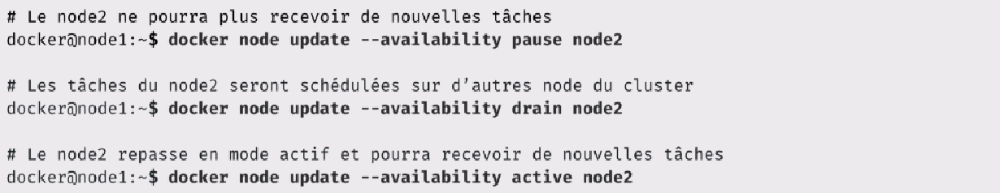
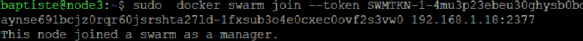

ifndef::_main_loaded[]
include::../config/load_attributes.adoc[]
endif::_main_loaded[]
//titre de la section
[[docker_swarm]]
= Docker Swarm
ifndef::_main_loaded[]
include::../config/header_attributes.adoc[]
endif::_main_loaded[]


Nous allons aborder la solution d'orchestration développée par Docker : *SWARM*.

== Swarm mode

=== Présentation
Lorsque l'on initialise un *Cluster Swarm*, on met donc à disposition les fonctionnalités d'orchestration du Docker Daemon.

Swarm est un *orchestrateur*, comme Kubernetes. Cela permet de gérer et déployer des applications qui tournent dans des conteneurs.

On définit une application dans le Docker Compose que l'on déploie dans le Cluster.

Dans Swarm, il y a une boucle de réconciliation qui compare l'état désiré de chaque service avec l'état actuel, et s'assure qu'il soit tel que défini dans le fichier *Docker Compose*.

Il y a une gestion des mises à jour de l'application, appelé *rolling update*.

Le *Swarm Mode* utilise une notion de `vIP`, une adresse *IP virtuelle* pour chaque service. Ainsi, quand un service est appelé par son nom, c'est le serveur DNS embarqué dans le Docker Daemon qui va retourner cette `vIP`.
Et quand une requête arrive sur cette vIP, on a un mécanisme de `load balancing` qui entre en action et qui va rediriger le traffic vers un des conteneurs du service en question.

Swarm, permet de sécuriser les échanges au sein du cluster et d'encrypter les données.

=== Les primitives

Il existe plusieurs primitives qui ont été introduite dans le contexte d'un cluster Swarm.

* `Node` : Une machine membre d'un cluster Swarm.
* `Service` : Qui permet de spécifier la façon dont on veut lancer les conteneurs d'une application.
* `Stack` : Un groupe de service. Par exemple, quand on déploie une application définie dans un format `Docker Compose`, on crée une Stack.
* `Secret` : Un objet secret permet de conserver de façon sécurisée les données sensibles d'une application : Clé privée, mots de passe..Etc
* `Config` : Cet objet permet de gérer la configuration des applications.

=== Vue d'ensemble


Nous constatons qu'il y a ici plusieurs `Dockers Host`, appelée : `Nodes`.
Les 2 Nodes de droites sont les managers du cluster, ils participent à l'algorithme de consensus.

Les Nodes, Workers, sont destinés à déployer les applications sur le cluster.

=== Les commandes de base


Pour créer un Swarm : 

[source, javascript]
----
docker swarm init
----

Pour ajouter un Node : 
[source, javascript]
----
docker swarm join
----

L'API permet également d'ajouter une clé de cryptage offrant une couche de sécurité en plus dans le cluster.

== Raft : Algorithme de consensus distribué

Animation en anglais permettant d'illustrer le fonctionnement de cet algorithme.

http://thesecretlivesofdata.com/raft/


== Node

Dans le contexte de Swarm, nous avons des Nodes, qui sont simplement des machines sur laquelle tourne un Docker Daemon et qui font partis du Swarm.

Un Node peut être une machine virtuelle ou physique et peut être soit Manager, soit Worker.


S'il est Manager, il peut être Leader, c'est-à-dire responsable de la gestion du Swarm et des décisions d'orchestration. Ou bien, il peut être un manager non-leader et peut participer au consensus Raft.

Si le leader devient non disponible, il pourra être élu comme leader.

Un Node de type Worker, ne va pas participer au consensus Raft, mais va recevoir des instructions du leader et exécute des tâches.

=== Les états d'un Node (availability)

* *Active* : Peut recevoir des tâches.
* *Pause* : Ne peut pas recevoir des tâches. Les tâches en cours ne peuvent pas être modifiées.
* *Drain* : Ne peut pas recevoir des tâches. Les tâches en cours sont stoppées et relancées sur d'autres Nodes.

*Les commandes de base pour la primitive Node :*


=== Node : Initialisation du Swarm

[NOTE]
====
Le Node sur lequel le Swarm est initialisé devient Leader.
====

image::../images/image130.png[]

=== Node : Ajout d'un worker

* Machine pouvant communiquer avec le manager du Swarm.
* Les commandes Docker doivent être lancées sur un manager.


=== Node : Ajout d'un manager

* Récupération d'un token depuis le manager
* Un manager non Leader a le statut Reachable


=== Node : promotion / destitution

* Commandes lancées depuis un manager


=== Node : Availability

* Une valeur parmi : Active / Pause / Drain
* Contrôle le déploiement des tâches sur un node



=== Node : Label

* Permet l'organisation des nodes
* Peut-être utilisé dans les contraintes de déploiement d'un service


== [DEMO] Création d'un Swarm

Avec Virtual Box nous avons créé 3 machines virtuelles sous Ubuntu avec Docker Daemon d'installé dessus.


Dans un premier temps nous allons initialiser notre `swarm` avec la commande :


[source, javascript]
----
docker swarm init
----


Nous pouvons lister la liste des Node présent : 

[source, javascript]
----
docker node ls
----


Le `node` qui a initialisé le `swarm` devient automatiquement le `Leader`.
À partir de lui nous pourrons ajouter un `Worker` grâce à la commande qui est fournie lors de l'initialisation.

* Allons maintenant sur le `Node2` afin d'exécuter cette commande dessus et en faire un `Worker` pour notre `Swarm`.

[source, ]
----
 docker swarm join --token SWMTKN-1-4mu3p23ebeu30ghysb0bqaynse691bcjz0rqr60jsrshta27ld-76lagmzkiy07ltf0cqjk5w6r9 192.168.1.18:2377
----

Maintenant, sur `Node1` regardons la liste des Nodes présent sur le Swarm :

[source, ]
----
docker node ls
----


Nous avons deux nœuds, un `Worker` et un `Leader Manager`.


* Ajoutons donc `Node3` dans notre `Swarm` avec un status de `Manager` :

Dans un premier temps, il faut exécuter la commande suivante sur le `Node1` afin de récupérer un `token` qui permettra à `Node3` de joindre le `Swarm`.

[source, ]
----
docker swarm join-token manager
----

Nous avons obtenu en réponse la commande à saisir dans le `Node3` :

[source, ]
----
 docker swarm join --token SWMTKN-1-4mu3p23ebeu30ghysb0bqaynse691bcjz0rqr60jsrshta27ld-1fxsub3o4e0cxec0ovf2s3vw0 192.168.1.18:2377
----



À partir du Node1, listons la liste des Nodes.

[source, javascript]
----
docker node ls
----


Dans un node Manager, nous pouvons aussi inspecter un autre noeud par exemple et obtenir des informations précises. 

[source, javascript]
----
docker node inspect node1
----

Nous pouvons rétrograder un `Node`, par exemple, le `Node3`, nommons le maintenant comme étant un simple `Worker`.

[source, ]
----
docker node demote node3
----

Et inversement, pour promouvoir : 

[source, javascript]
----
docker node promote node2
----

== [Exercice] Création en local

=== Quelques rappels sur Docker Swarm

Swarm est la solution de clustering de Docker et permet entre autres:

- le management d’un cluster d’hôtes Docker
- l’orchestration de services sur ce cluster

Un cluster Swarm est composé de 2 types de nodes:

- Les managers dont le rôle est de maintenir l’état du cluster. En interne, une implémentation de l’algorithme de consensus Raft est utilisée pour assurer cette fonction.
- Les workers dont le rôle est d’exécuter des tasks (= lancer des containers)

[NOTE]
====
Par défaut, un manager est également un worker.
====

Le schéma suivant montre la vision haut niveau d’un cluster Swarm.


Par défaut, un Swarm est sécurisé:

- encryption des logs nécessaires à la gestion du cluster
- communication TLS entre les différents nodes
- auto-rotation des certificats


Dans la suite, nous allons créer un cluster swarm en local composé d’un manager et de 2 workers.
Nous allons envisager différents cas de figure en fonction de la version de Docker:

- Docker Desktop (Mac), anciennement Docker for Mac
- Docker Desktop (Windows), anciennement Docker for Windows
- Docker for Ubuntu (ou pour d'autres distribution Linux)

Pour effectuer cela, nous utiliserons Docker Machine afin de créer 3 hôtes

=== Création des hôtes avec Docker Machine

==== Docker machine

Docker Machine est un utilitaire qui permet de créer une machine virtuelle et d'installer Docker, le client et le daemon, sur celle-ci. Il permet également de gérer le cycle de vie de ces hôtes Docker.

La commande suivante permet d'obtenir la liste des opérations qu'il est possible de faire avec docker-machine.

```
$ docker-machine --help
```

Si vous utilisez Docker Desktop ou Docker Toolbox, le binaire docker-machine est déjà disponible sur votre environnement. Dans les autres cas, il faudra l'installer, c'est un process très simple dont les instructions sont détaillées à l'adresse https://docs.docker.com/machine/install-machine/ )

En fonction de l'environnement sur lequel vous êtes, il faudra utiliser le driver approprié ci-dessous.

==== Docker Desktop (Windows)

L'édition Windows de Docker Desktop utilise l'hyperviseur **Hyper-V**, il faudra dans un premier temps créer un switch virtuel depuis l'interface de Hyper-V, puis ensuite utiliser le driver "hyperv" de docker-machine en précisant le nom de ce switch.

Dans l'exemple ci dessous on utilise un switch virtuel nommé **DMSwitch**.

```
PS C:\WINDOWS\system32> docker-machine create --driver hyperv --hyperv-virtual-switch "DMSwitch" node1
Running pre-create checks...
Creating machine...
(node1) Copying C:\Users\luc\.docker\machine\cache\boot2docker.iso to C:\Users\luc\.docker\machine\machines\node1\boot2docker.iso...
(node1) Creating SSH key...
(node1) Creating VM...
(node1) Using switch "DMSwitch"
(node1) Creating VHD
(node1) Starting VM...
(node1) Waiting for host to start...
Waiting for machine to be running, this may take a few minutes...
Detecting operating system of created instance...
Waiting for SSH to be available...
Detecting the provisioner...
Provisioning with boot2docker...
Copying certs to the local machine directory...
Copying certs to the remote machine...
Setting Docker configuration on the remote daemon...
Checking connection to Docker...
Docker is up and running!
To see how to connect your Docker Client to the Docker Engine running on this virtual machine, run: C:\Program Files\Docker\Docker\Resources\bin\docker-machine.exe env node1
```

De la même façon nous créeons les 2 autres hôtes, node2 et node3.

```
PS C:\WINDOWS\system32> docker-machine create --driver hyperv --hyperv-virtual-switch "DMSwitch" node2
PS C:\WINDOWS\system32> docker-machine create --driver hyperv --hyperv-virtual-switch "DMSwitch" node3
```

La commande suivante permet de lister les hôtes que nous venons de créer

```
PS C:\WINDOWS\system32> docker-machine ls
NAME    ACTIVE   DRIVER   STATE     URL                       SWARM   DOCKER        ERRORS
node1   -        hyperv   Running   tcp://192.168.1.25:2376           v18.09.1
node2   -        hyperv   Running   tcp://192.168.1.26:2376           v18.09.1
node3   -        hyperv   Running   tcp://192.168.1.27:2376           v18.09.1
```

==== Docker Desktop (Mac)

Pour Docker for Mac, nous utilisons [Virtualbox](https://www.virtualbox.org/) afin d'instantier 3 machines virtuelles.

La commande suivante permet de créer un hôte nommé **node1**

```
$ docker-machine create --driver virtualbox node1
Running pre-create checks...
Creating machine...
(node1) Copying /Users/luc/.docker/machine/cache/boot2docker.iso to /Users/luc/.docker/machine/machines/node1/boot2docker.iso...
(node1) Creating VirtualBox VM...
(node1) Creating SSH key...
(node1) Starting the VM...
(node1) Check network to re-create if needed...
(node1) Waiting for an IP...
Waiting for machine to be running, this may take a few minutes...
Detecting operating system of created instance...
Waiting for SSH to be available...
Detecting the provisioner...
Provisioning with boot2docker...
Copying certs to the local machine directory...
Copying certs to the remote machine...
Setting Docker configuration on the remote daemon...
Checking connection to Docker...
Docker is up and running!
To see how to connect your Docker Client to the Docker Engine running on this virtual machine, run: docker-machine env node1
```

De la même façon nous créeons les 2 autres hôtes, node2 et node3.

```
$ docker-machine create --driver virtualbox node2
$ docker-machine create --driver virtualbox node3
```

Nous pouvons alors nous assurer que nos 3 hôtes sont en état de marche en lançant la commande suivante:

```
$ docker-machine ls
NAME    ACTIVE   DRIVER       STATE     URL                         SWARM   DOCKER        ERRORS
node1   -        virtualbox   Running   tcp://192.168.99.100:2376           v18.09.1
node2   -        virtualbox   Running   tcp://192.168.99.101:2376           v18.09.1
node3   -        virtualbox   Running   tcp://192.168.99.102:2376           v18.09.1
```

==== Docker for Ubuntu

De la même façon que pour Docker Desktop, dans un environnement Linux nous utiliserons [Virtualbox](https://www.virtualbox.org/) afin d'instantier 3 machines virtuelles.

```
$ docker-machine create --driver virtualbox node1
Running pre-create checks...
(node1) Default Boot2Docker ISO is out-of-date, downloading the latest release...
(node1) Latest release for github.com/boot2docker/boot2docker is v18.09.1
(node1) Downloading /home/luc/.docker/machine/cache/boot2docker.iso from https://github.com/boot2docker/boot2docker/releases/download/v18.09.1/boot2docker.iso...
(node1) 0%....10%....20%....30%....40%....50%....60%....70%....80%....90%....100%
Creating machine...
(node1) Copying /home/luc/.docker/machine/cache/boot2docker.iso to /home/luc/.docker/machine/machines/node1/boot2docker.iso...
(node1) Creating VirtualBox VM...
(node1) Creating SSH key...
(node1) Starting the VM...
(node1) Check network to re-create if needed...
(node1) Waiting for an IP...
Waiting for machine to be running, this may take a few minutes...
Detecting operating system of created instance...
Waiting for SSH to be available...
Detecting the provisioner...
Provisioning with boot2docker...
Copying certs to the local machine directory...
Copying certs to the remote machine...
Setting Docker configuration on the remote daemon...
Checking connection to Docker...
Docker is up and running!
To see how to connect your Docker Client to the Docker Engine running on this virtual machine, run: docker-machine env node1
```

Nous répétons alors la procédure pour créer 2 autres hôtes Docker

```
$ docker-machine create --driver virtualbox node2
$ docker-machine create --driver virtualbox node3
```

De la même façon que précédemment, la commande suivante permet de s'assurer que les 3 hôtes sont en état de marche:

```
$ docker-machine ls
NAME    ACTIVE   DRIVER       STATE     URL                         SWARM   DOCKER        ERRORS
node1   -        virtualbox   Running   tcp://192.168.99.100:2376           v18.09.1
node2   -        virtualbox   Running   tcp://192.168.99.101:2376           v18.09.1
node3   -        virtualbox   Running   tcp://192.168.99.102:2376           v18.09.1
```

=== Création du swarm

Maintenant que nous avons créé les 3 hôtes Docker, nous allons les mettre en cluster en créant un swarm.

==== Initialisation à partir de node1

La commande suivante permet de nous connecter en ssh sur node1

```
$ docker-machine ssh node1
```

Nous pouvons ensuite initialiser le swarm

```
$ docker swarm init
Swarm initialized: current node (preife0qe9vjyum4rv13qm33l) is now a manager.

To add a worker to this swarm, run the following command:

    docker swarm join \
    --token SWMTKN-1-0jo31iectxf4uo4airmn1cepphe9mbg4j8j6276as56i6gi82c-8ggnqa3165gb0x8idf8tqs68p \
    10.0.107.3:2377

To add a manager to this swarm, run 'docker swarm join-token manager' and follow the instructions.
```

 Attention, lors de l'initialisation il est possible que vous obteniez une erreur semblable au message suivant

 ```
Error response from daemon: could not choose an IP address to advertise since this system has multiple addresses on different > interfaces (10.0.2.15 on eth0 and 192.168.99.100 on eth1) - specify one with --advertise-addr
 ```

Il faudra dans ce cas préciser l'adresse IP sur laquelle le manager sera accessible. On pourra initialiser le swarm avec la commande suivante:

```
$ docker swarm init --advertise-addr 192.168.99.100
```

Le daemon Docker du node1 est maintenant en Swarm mode, nous pouvons lister les nodes de notre cluster.

```
$ docker node ls
ID                           HOSTNAME   STATUS   AVAILABILITY   MANAGER STATUS  ENGINE VERSION
tntzagkqg9uchatr8hzh8alio *  node1      Ready    Active         Leader          18.09.1
```

==== Ajout des workers

Depuis les 2 autres terminaux, nous lançons la commande **docker swarm join...** obtenue lors de l’initialisation du Swarm.

```
$ docker swarm join \
    --token SWMTKN-1-0jo31iectxf4uo4airmn1cepphe9mbg4j8j6276as56i6gi82c-8ggnqa3165gb0x8idf8tqs68p \
    192.168.99.100:2377
```

Nous obtenons alors la réponse suivante

```
This node joined a swarm as a worker.
```

Depuis le node1 (seul manager de notre swarm), nous pouvons alors lister les nodes présents dans notre cluster.

```
$ docker node ls
ID                           HOSTNAME    STATUS  AVAILABILITY  MANAGER STATUS   ENGINE VERSION
tntzagkqg9uchatr8hzh8alio *  node1       Ready   Active        Leader           18.09.1
7avuhygyf15ia91kyotee6zxf    node2       Ready   Active                         18.09.1
ua03a3x0rtgrbnbnq2nifdtm2    node3       Ready   Active                         18.09.1
```

Le node1 est l’unique manager du cluster, node2 et node3 sont des workers.

[NOTE]
====
Toutes les commandes du client Docker doivent être envoyées sur un manager, si nous lançons la commande précédente sur node2 ou node3, nous obtenons l’erreur suivante.
====

```
$ docker node ls
Error response from daemon: This node is not a swarm manager. Worker nodes can't be used to view or modify cluster state. Please run this command on a manager node or promote the current node to a manager.
Inspection d’un node
```

=== Inspection d'un hôte

Comme pour les autres primitives de la plateforme (containers, images, volumes, networks), la commande inspect permet d’obtenir la vue détaillée d’un node.

```
$ docker node inspect node1
[
    {
        "ID": "jrqb09bsa47xb23pyrw0fgah4",
        "Version": {
            "Index": 9
        },
        "CreatedAt": "2017-11-03T14:00:17.670877138Z",
        "UpdatedAt": "2017-11-03T14:00:18.278047861Z",
        "Spec": {
            "Labels": {},
            "Role": "manager",
            "Availability": "active"
        },
        "Description": {
            "Hostname": "node1",
            "Platform": {
                "Architecture": "x86_64",
                "OS": "linux"
            },
            "Resources": {
                "NanoCPUs": 1000000000,
                "MemoryBytes": 1044123648
            },
            "Engine": {
                "EngineVersion": "17.10.0-ce",
                "Labels": {
                    "provider": "virtualbox"
                },
                "Plugins": [
                    {
                        "Type": "Log",
                        "Name": "awslogs"
                    },
                    {
                        "Type": "Log",
                        "Name": "fluentd"
                    },
                    {
                        "Type": "Log",
                        "Name": "gcplogs"
                    },
                    {
                        "Type": "Log",
                        "Name": "gelf"
                    },
                    {
                        "Type": "Log",
                        "Name": "journald"
                    },
                    {
                        "Type": "Log",
                        "Name": "json-file"
                    },
                    {
                        "Type": "Log",
                        "Name": "logentries"
                    },
                    {
                        "Type": "Log",
                        "Name": "splunk"
                    },
                    {
                        "Type": "Log",
                        "Name": "syslog"
                    },
                    {
                        "Type": "Network",
                        "Name": "bridge"
                    },
                    {
                        "Type": "Network",
                        "Name": "host"
                    },
                    {
                        "Type": "Network",
                        "Name": "macvlan"
                    },
                    {
                        "Type": "Network",
                        "Name": "null"
                    },
                    {
                        "Type": "Network",
                        "Name": "overlay"
                    },
                    {
                        "Type": "Volume",
                        "Name": "local"
                    }
                ]
            },
            "TLSInfo": {
                "TrustRoot": "-----BEGIN CERTIFICATE-----\nMIIBaTCCARCgAwIBAgIUIDgi01oBB7DgxX0wYvAaHBj8z14wCgYIKoZIzj0EAwIw\nEzERMA8GA1UEAxMIc3dhcm0tY2EwHhcNMTcxMTAzMTM1NTAwWhcNMzcxMDI5MTM1\nNTAwWjATMREwDwYDVQQDEwhzd2FybS1jYTBZMBMGByqGSM49AgEGCCqGSM49AwEH\nA0IABPOOT4AHEM48JwGIp0aiFDHRtXSVQm9yJoaM3awlok7zwVJfVcLWESVT7B9u\n4LQtjT5S1+ZUDa1UjQELWQtGaHajQjBAMA4GA1UdDwEB/wQEAwIBBjAPBgNVHRMB\nAf8EBTADAQH/MB0GA1UdDgQWBBTdFvlG+hSDdP+AFSL0ZiSEjetnWDAKBggqhkjO\nPQQDAgNHADBEAiB9atr7uP0eclaq06Z91kyOH8IYxXW9jxInIfNu37BtXgIgfqWu\nQ51iyG4tNLodPgyxefMEpQrFS/pfDGDlu2Timi4=\n-----END CERTIFICATE-----\n",
                "CertIssuerSubject": "MBMxETAPBgNVBAMTCHN3YXJtLWNh",
                "CertIssuerPublicKey": "MFkwEwYHKoZIzj0CAQYIKoZIzj0DAQcDQgAE845PgAcQzjwnAYinRqIUMdG1dJVCb3ImhozdrCWiTvPBUl9VwtYRJVPsH27gtC2NPlLX5lQNrVSNAQtZC0Zodg=="
            }
        },
        "Status": {
            "State": "ready",
            "Addr": "192.168.99.100"
        },
        "ManagerStatus": {
            "Leader": true,
            "Reachability": "reachable",
            "Addr": "192.168.99.100:2377"
        }
    }
]
```

Cette commande retourne entre autres:
- le status du node
- son rôle (manager vs worker)
- les plugins disponibles
- le certificat TLS

Nous pouvons utiliser les Go template afin d’obtenir une information précise contenue dans cette structure json. Par exemple, la commande suivante permet de récupérer l’adresse IP du node directement.

```
$ docker node inspect -f "{{ .Status.Addr }}" node1
```

=== Mise à jour d’un node

Une fois les nodes crées, il est possible de changer leur rôle et de:
- promouvoir un worker en manager
- destituer un manager en worker

==== Promotion de node2

La commande suivante permet de changer le node2 et d'en faire un manager

```
$ docker node promote node2
Node node2 promoted to a manager in the swarm.
```

Les commandes Docker peuvent maintenant être lancées depuis node1 ou node2 puisque tous 2 sont des managers.

```
$ docker node ls
ID                           HOSTNAME    STATUS  AVAILABILITY  MANAGER STATUS   ENGINE VERSION
tntzagkqg9uchatr8hzh8alio *  node1       Ready   Active        Leader           18.09.1
7avuhygyf15ia91kyotee6zxf    node2       Ready   Active        Reachable        18.09.1
ua03a3x0rtgrbnbnq2nifdtm2    node3       Ready   Active                         18.09.1
```

Le node2 a l’entrée Reachable dans la colonne MANAGER STATUS, ce qui signifie qu’il est du type manager, mais pas Leader.

==== Destitution du node2

Depuis node1 ou node2, nous pouvons destituer le node2 et le repasser en worker.

```
$ docker node demote node2
Manager node2 demoted in the swarm.
```

Si nous listons une nouvelle fois les nodes du cluster, nous pouvons voir que le node2 n’a plus d’entrée dans la colonne MANAGER STATUS.

```
$ docker node ls
ID                           HOSTNAME    STATUS  AVAILABILITY  MANAGER STATUS   ENGINE VERSION
tntzagkqg9uchatr8hzh8alio *  node1       Ready   Active        Leader           18.09.1
7avuhygyf15ia91kyotee6zxf    node2       Ready   Active                         18.09.1
ua03a3x0rtgrbnbnq2nifdtm2    node3       Ready   Active                         18.09.1
```

=== Résumé

Nous avons vu dans cet exercice la façon de créer un swarm en local, soit en utilisant VirtualBox, soit en utilisant l'hyperviseur Hyper-V.

== [DEMO] Création d'un Service

Nous allons créer un nouveau service basé sur l'image `nginx`.

[source, ]
----
docker service create --name www -p 80:80 --replicas 3 nginx
----

Listons les services de notre Swarm :
[source, javascript]
----
docker service ls
----


Nous pouvons rajouter des réplicats

[source, ]
----
docker service scale www=5
----
Listons les services `www` :

[source, javascript]
----
docker service ps www
----


Nous constatons que les services se répartissent sur les nodes du Swarm.


== Création d'un service

Dans cette partie, nous allons créer un service simple, le déployer et le scaler (c'est à dire modifier le nombre de containers instanciés pour celui-ci). Nous changerons également la disponibilité d’un node pour voir l’impact sur les tâches en cours.

=== Pré-requis

Vous pouvez utiliser un Swarm que vous avez créé lors des exercices précédent, ou bien en créer un nouveau. N'hésitez pas à vous reporter aux cours ou bien aux exercices précédents si vous avez besoin de revoir le process de création.

=== Création d’un service

Utilisez la commande suivante pour créer le service nommé *vote* ayant les spécifications ci-dessous:

- basé sur l’image *instavote/vote:latest*
- publication du 80 sur le port 8080 des nodes du Swarm
- 6 réplicas

Le nombre de réplicas correspond au nombre de tâches qui seront instanciées pour ce service. Chaque tâche lancera un container basée sur l’image définie dans le service.

Lancez cette commande dpuis un node qui a le status de manager.

```
$ docker service create \
    --name vote \
    --publish 8080:80 \
    --replicas 6 \
    instavote/vote
```

Après quelques secondes, le temps que l’image *instavote/vote:latest* soit téléchargée sur chaque node, les 6 tâches du services sont lancées.

```
iloiyvba6uensc6bzvhvbxv93
overall progress: 6 out of 6 tasks
1/6: running   [==================================================>]
2/6: running   [==================================================>]
3/6: running   [==================================================>]
4/6: running   [==================================================>]
5/6: running   [==================================================>]
6/6: running   [==================================================>]
verify: Service converged
```

Utilisez la commande suivante pour lister les tâches du service *vote*.

```
$ docker service ps vote
```

Vous devriez obtenir un résultat proche du résultat suivant (aux identifiants près), indiquant qu'il y a 2 tâches par node.

```
ID            NAME    IMAGE                   NODE   DESIRED STATE  CURRENT STATE           ERROR PORTS
xnon20jonsfd  vote.1  instavote/vote:latest   node2  Running        Running 13 minutes ago
rganh2g8y8b7  vote.2  instavote/vote:latest   node3  Running        Running 13 minutes ago
on8oog1833yq  vote.3  instavote/vote:latest   node1  Running        Running 13 minutes ago
hmp2wtvojxro  vote.4  instavote/vote:latest   node2  Running        Running 13 minutes ago
vdizjy291q4t  vote.5  instavote/vote:latest   node3  Running        Running 13 minutes ago
mjpn0ybsg6pj  vote.6  instavote/vote:latest   node1  Running        Running 13 minutes ago
```

Le service publie le port 80 sur le port 8080 du swarm via le mécanisme de routing mesh. Cela signifie que le service sera accessible depuis le port 8080 de chaque node du cluster. Nous pouvons vérifier le routing mesh en envoyant une requête sur le port 8080 de node1, node2 ou node3. Quelque soit le node sur lequel la requête est envoyée, nous aurons accès à l'interface de l'application. Nous reviendrons en détails sur le routing mesh un peu plus tard dans le cours.


[NOTE]
====
Seule la partie front-end est disponible sur cet exemple, il n’y a pas le backend permettant de prendre en compte la sélection.
====

Les requêtes envoyées sur le port 8080 d’un node du Swarm sont traitées selon un algorithme de round-robin entre les différents containers intanciés pour le service. Cela signifie que chacun des containers recevra une requète à tour de rôle.

Nous pouvons l’observer en lançant plusieurs requêtes à la suite et observer l’identifiant ID du container depuis l’interface web

=== Ajout du service de visualisation

Utilisez la commande suivante pour lancer un service qui servira à la visualisation des containers sur le cluster.

```
$ docker service create \
  --name visualizer \
  --mount type=bind,source=/var/run/docker.sock,destination=/var/run/docker.sock \
  --constraint 'node.role == manager' \
  --publish "8000:8080" dockersamples/visualizer:stable
```

Ce service a la spécification suivante:
- il est nommé *visualizer*
- il fait un bind-mount de la socket */var/run/docker.sock/* afin de permettre au container du visualizer de dialoguer avec le daemon Docker sur lequel il tourne
- il utilise une contrainte de déploiement pour que le replica du service tourne sur le node qui a le rôle manager
- il publie le port *8080* sur le port *8000* sur chaque hôte du Swarm

Nous pouvons alors voir la répartition des containers sur les nodes via l’interface du visualiseur. Cette interface donne le même résultat que lorsque l’on liste les service en ligne de commande, mais c’est une façon assez ludique de visualiser les containers.


Note: le visualizer tourne sur le node master mais il est possible d'y accéder depuis n'importe quel node du Swarm grace au mécanisme de routing mesh

=== Passage du node2 en drain

Un node est dans l’un des états suivants:
- active, il peut recevoir des nouvelles tâches
- pause, il ne peut pas recevoir de nouvelles tâches mais les tâches en cours restent inchangées
- drain, il ne peut plus recevoir de nouvelles tâches et les tâches en cours sont re-schédulées sur d’autres nodes

Avec la commande suivante, changez l’availability du *node2* en lui donnant la valeur *drain*.

```
$ docker node update --availability drain node2
```

Depuis le visualizer, regardez comment la répartition des tâches précédentes a été modifiée.


Nous pouvons voir qu’il n’y a plus de tâche sur le node2. Elles ont été stoppées et reschédulées sur les autres nodes.

La commande suivante change l’availability du node2 en le repositionnant dans l’état active. Les tâches existantes sur node1 et node3 restent inchangées mais de nouvelles tâches pourront de nouveau être schédulées sur node2.

```
$ docker node update --availability active node2
```

=== En résumé

Nous avons vu dans cette mise en pratique comment créer des services très simples. Nous avons également vu l'influence de la propriété *availability* d'un node par rapport à la répartition des tâches des services.

