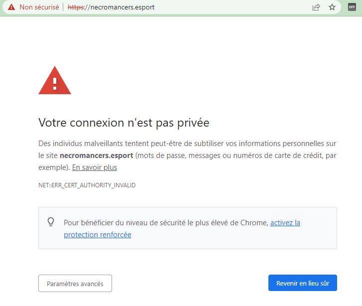
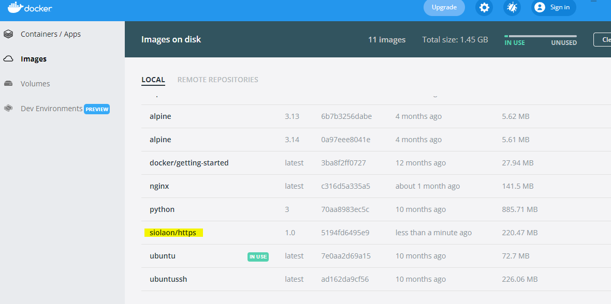

== Serveur HTTPS avec Docker

Dans la partie 13.1, nous avons mis en place un container Apache
permettant d’accéder à notre site web par l'intermédiaire de l'adresse :
http://localhost:2000 Mais la connexion `http` n'est pas sécurisée. Pour
cela, il faut que le protocole soit `https`.

*Rappel : Création des certificats SSL*

Les applications Web utilisent le protocole `HTTPS` pour s'assurer que
les communications entre les clients et le serveur soient cryptées et ne
puissent pas être interceptées. De plus, *Google* pénalise le contenu
des sites web qui utilisent le protocole `HTTP` seul dans le
référencement. Il est donc obligatoire de configurer notre serveur pour
lui permettre d’être accessible via le protocole `HTTPS`.

Pendant le développement local, les développeurs utilisent :

* Soit le protocole *HTTP*.
+
Cela signifie alors que les versions du projet en local ou en production
sont développées dans un environnement différent. Cela peut être plus
difficile pour repérer les problèmes.
* Soit un (faux) certificat *SSL Autosigné*.
+
L’environnement de développement est alors proche de l’environnement de
production, mais le navigateur continue de traiter les requêtes
différemment. Par exemple, les fausses requêtes SSL ne sont pas mis en
cache.

Toutes les communications clients/serveurs ont besoin d’être sécurisés
avec un protocole. Nous utiliserons SSL (Secure Socket Layer).

Les communications sécurisées entre des applications se font grâce à des
certificats (CERT) distribués par une autorité certifiante (CA) qui est
mutuellement agréé par le client et le serveur.

*Le format CERT*

La plupart des certificats ont pour extension `.pem`, `.cer`, `.crt`,
`.key`. Les clients (navigateurs) communiquant avec le serveur vont
garder le fichier `*.pem` (PRIVACY ENHANCED MAIL) ou `*.CER` (extension
pour les certificats SSL) pour établir une connexion sécurisée.

image:../images/image83.png[image]

L’algorithme RSA (_Rivest Shamir Adleman_) est utilisé pour crypter et
décrypter les messages dans une communication où une clé est gardée
publique et l’autre clé est privée. C’est le concept de chiffrage
asymétrique.

. Le client demande une ressource protégée au serveur.
. Le client présente les informations cryptées avec sa clé publique au
serveur.
. Le serveur évalue la requête avec sa clé privée (disponible seulement
coté serveur) et répond en retour en rapport avec la ressource demandée
par le client.

Cela fonctionnerait de la même manière pour l'authentification mutuelle
où le client et le serveur fournissent tous deux leurs clés publiques et
déchiffrent leurs messages avec leurs propres clés privées disponibles
de leur côté.

[NOTE]
.Note
====
Nous avons déjà configuré `HTTPS` sur un serveur `apache` sous `Ubuntu`
lors de d'exercices précédents avec des machines virtuelles. Aujourd'hui
nous allons donc travailler sur cette distribution, revoir les étapes de
création d'un certificat SSL auto-signé et l'intégration dans une image
Docker. Bien entendu, il existe déjà des images toutes prêtes sur
*Docker Hub* ... mais nous n'apprendrons rien de nouveau aujourd'hui si
nous nous contenterions d'utiliser un existant.
====

Maintenant, construisons notre container.

Comme nous sommes en local, il nous faudra *autosigner* nos certificats
*SSL*.

Stoppons d’abord le container `serveur_http` précédent qui utilise le
port `2000` :

[source,]
----
docker container stop serveur_http
----

Nous allons installer un container avec une image `Ubuntu` et mapper les
`ports 80` et `443` de la machine hôte avec les même ports du container.

[source,]
----
docker run -it -p 80:80 -p 443:443 --name serveur_https ubuntu /bin/sh;
----

Installons un éditeur de texte `nano` , `apache2` notre serveur http et
`opennss` qui permettra de générer des certificats.

[source,]
----
apt update
apt install nano apache2 openssl –y
----

Il faut maintenant démarrer le serveur *Apache*:

[source,]
----
service apache2 start
----

Testons dans le navigateur : http://localhost

Nous voulons un site pour notre équipe de *Esport* : Les _Necromancers_
!

Créons donc un dossier spécialement pour eux!

[source,]
----
mkdir /var/www/html/esport
----

Et créons dedans un fichier `index.html` qui contiendra le code suivant
:

[source,html]
----
<h1>Page de test des NECROMANCERS !!</h1>
----

Pour cela nous utiliserons notre éditeur de texte `nano` :

[source,]
----
nano  /var/www/html/esport/index.html
----

Rappel : Pour sauvegarder, tapez au clavier sur les touches `CTRL` + `O`
et `Entrée` et pour quitter `CTRL` + `X`

Nous allons maintenant modifier notre fichier HOSTS sur la machine hôte
afin de forcer la redirection du domaine
http://necromancers.esport[necromancers.esport] sur notre serveur local
en cours de conception.

Ouvrez Visual Studio Code ou un autre éditeur comme NotePad++ avec des
droits d'administrateur, et éditez le fichier :

[source,]
----
C:\Windows\System32\drivers\etc\hosts
----

Ajoutez la ligne suivante :

[source,]
----
127.0.0.1 necromancers.esport
----

Puis modifiez les paramètres du proxy comme suit :

image:../images/image91.png[image]

Ainsi, nous ne passerons pas par le proxy, ni par le DNS pour accéder à
notre site avec l'url http://necromancers.esport[necromancers.esport] ,
mais sur le serveur local d'addresse IP directement: `127.0.0.1`.

Maintenant, il faut configurer *Apache* dans notre container pour que
notre URL pointe vers le dossiers WEB du serveur.

`Apache` permet de faire des redirections de connexions entrantes sur un
de ses ports vers un dossier de notre choix. Cela se fait grâce aux
`VirtualHost`. Copions le fichier `VirtualHost` de base nommé
`000-default.conf` et appelons cette copie `esport.conf`.

[source,]
----
cp /etc/apache2/sites-available/000-default.conf /etc/apache2/sites-available/esport.conf
----

Modifions maintenant ce nouveau fichier :

[source,]
----
nano /etc/apache2/sites-available/esport.conf
----

image:../images/image84.png[image]

Profitons-en aussi pour modifier le fichier `/etc/apache2/apache2.conf`.
Et lui rajouter une ligne : `ServerName localhost`. Cela va permettre de
nommer notre serveur local, et d'éviter d'avoir des avertissements au
redémarrage.

Le fichier `esport.conf` est prêt ! Il faut le charger dans la
configuration du serveur *Apache2*.

[source,]
----
a2ensite esport
----

Pour que les modifications soient prise en compte, redémarrons le
serveur.

[source,]
----
service apache2 restart
----

Maintenant que notre serveur *Apache* est configuré pour que l'adresse :
http://necromancers.esport[necromancers.esport] pointe vers notre
dossier web. ( Testez ! )

Il nous faut installer un certificat pour obtenir une connexion
sécurisée en `HTTPS`.

[source,]
----
openssl req -x509 -nodes -days 365 -newkey rsa:2048 -keyout /etc/ssl/private/esport.key -out /etc/ssl/certs/esport.crt
----

Cette commande va créer 2 certificats dans les emplacements :
`/etc/ssl/private/esport.key` et `/etc/ssl/certs/esport.crt`.

Il faut maintenant installer les certificats sur le serveur et les
associés à notre domaine.

Copions le fichier de base `default-ssl.conf` et renommons le en
`esport-ssl.conf`.

[source,]
----
cp /etc/apache2/sites-available/default-ssl.conf /etc/apache2/sites-available/esport-ssl.conf
----

Il s'agit simplement d'un `VirtualHost` qui est chargé de rediriger les
connexions entrantes provenant du port 443, le port dédié au protocole
`HTTPS`.

Editons ce fichier :

[source,]
----
nano /etc/apache2/sites-available/esport-ssl.conf
----

image:../images/image85.png[image]

Pour tester notre configuration, il faut executer la commande :

[source,]
----
apachectl configtest
----

Et si tout ce passe bien, la réponse devrait être :

[source,]
----
# apachectl configtest
Syntax OK
----

Chargeons le module SSL dans apache pour qu'il puisse prendre en compte
les connexions HTTPS et les certificats.

[source,]
----
a2enmod ssl
----

Chargeons aussi le nouveau `VirtualHost` :

[source,]
----
a2ensite esport-ssl
----

En test l'adresse [.title-ref]#https://necromancers.esport
<https://necromancers.esport># depuis votre navigateur, Vous devriez
avoir cela :

image:../images/image86.png[image]

Il faut autoriser la connexion au site :

[NOTE]
.Note
====
Pourquoi nous avons ce message d'alerte ?

Tout simplement parce que le navigateur a détecté que nous sommes
connecté avec le protocole `HTTPS`. Notre serveur lui a fourni un
certificat ... qui est ... *autosigné* ! *Cela alerte donc le
navigateur*.
====

Nous voulons que si l'utilisateur tape `HTTP` dans l'adresse au lieu de
`HTTPS` le serveur puisse le rediriger automatiquement.

Activons le mode `rewrite` de Apache qui permet à Apache de
réécrire/reformater les URL captées :

[source,]
----
a2enmod rewrite
----

Et éditons le fichier

[source,]
----
nano /etc/apache2/sites-available/esport.conf
----

Ajoutons cette régle de réécriture d'url :

[source,]
----
RewriteEngine On
RewriteRule ^(.*)$ https://%{HTTP_HOST}$1 [R=301,L]
----

Redémarrons Apache :

[source,]
----
service apache2 restart
----

Notre serveur est maintenant correctement configuré !

[NOTE]
.Note
====
Vous pouvez être fier du travail accompli jusqu'alors ! Et pourquoi ne
pas créer une image basée sur cette configuration ? Afin de pouvoir
créer une infinité de container avec les même caractéristiques. Cela
évitera de recommencer toutes les étapes que nous avons suivies
jusqu'alors.
====

*Création d'une image Docker*

Nous avons jusqu'alors créé des containers à partir d'images de bases
que nous avons modifié. Il temps de créer notre propre image qui servira
de "moule" pour des containers ayant besoin des caractéristiques que
nous avons paramétrées.

Mais avant faisons un peu de ménage dans notre container. Supprimons le
fichier `index.html` du dossier `/var/www/html/esport`

[source,]
----
rm /var/www/html/esport/index.html
----

La commande pour créer une nouvelle image à partir d'un container est :

`docker commit <CONTAINER_ID> <NOM_DE_L_IMAGE>`

Il nous faut donc récupérer l'identifiant de notre container dans un
premier temps :

[source,]
----
docker ps -a
----

image:../images/image92.png[image]

`Serveur_https` possède bien l’identifiant : `00e15c9f63ea`

Maintenant, nous pouvons créer une nouvelle image à partir de cet
identifiant. Nous respecterons les conventions de nommage :
`<Nom du constructeur>` */* `<Nom de l'image>` *:*
`<Numéro de version>`.

Notre image s'appelera alors : `siolaon/https:1.0`.

Lançons la création de l'image avec l'option `-a` pour définir le nom de
l'auteur, mettez le votre car vous l'avez bien mérité:

[source,]
----
docker commit -a Bauer 00e15c9f63ea siolaon/https:1.0
----

Vérifions si l'image a bien été créée en listant les images disponibles
sur notre machine hôte.

[source,]
----
docker images
----

image:../images/image95.png[image]

Nous pouvons retrouver l'image également dans l'application Docker
Desktop, onglet "Images".

Stoppons maintenant notre container `serveur_https` :

[source,]
----
docker container stop serveur_https
----

Maintenant, voici venu le grand moment tant attendu ! Celui de monter
notre image, dans un nouveau container avec le dossier web esport !

Positionnons nous dans le répertoire contenant notre dossier `www`, pour
ma part:

[source,]
----
cd C:\Users\baptiste\Documents\docker\td\www
----

[source,]
----
docker container run -itd --name server_esport -v $PWD/esport:/var/www/html/esport -p 80:80 -p 443:443  siolaon/https:1.0
----

Maintenant il faut lancer le serveur apache2 manuellement depuis le
serveur :

[source,]
----
docker container exec -ti server_esport sh
----

et dans le `shell` lancer la commande :

[source,]
----
service apache2 start
----

Ouvrez le navigateur et contemplez votre oeuvre :

image:../images/image97.png[image]

