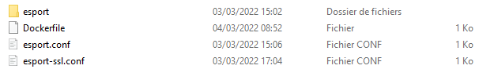
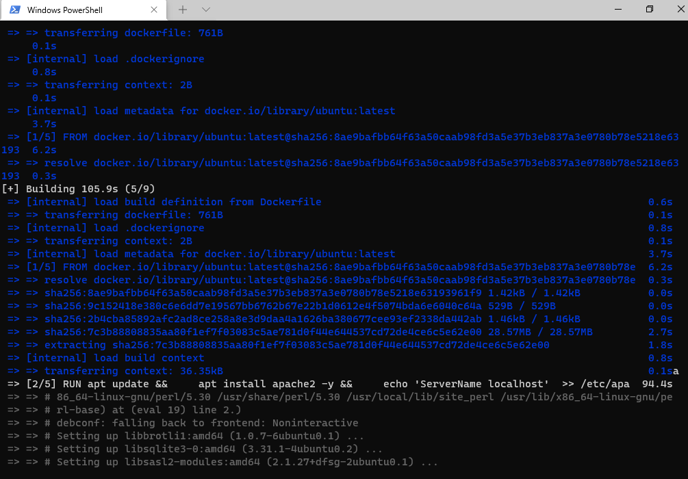

== Création d'un Dockerfile

Nous sommes satisfaits du résultat, mais il reste un goût d'inachevé,
n'est-ce pas ?

Créer un container à partir de notre image, et devoir lancer la commande
`service apache2 start` à partir de son `shell`, demande une
manipulation dont on aimerait pouvoir se passer ...

Cela va être possible en créant un fichier `Dockerfile`. Ce fichier
contient une liste de commande à exécuter pour concevoir notre propre
image.

Listons les actions effectuées dans la partie *13.2*

* Création d'un container avec une image `Ubuntu`.
* Nous avons mis à jour les dépôts `Ubuntu`.
* Nous avons installé `Apache2`.
* Nous avons installé `Nano`.
* Nous avons installé `OpenSSL` et récupéré 2 fichiers : `esport.key` et
`esport.crt`.
* Nous avons créé 2 fichiers *VirtualHost* `esport` et `vesport-ssl`
pour le site en *http* et *https*.
* Nous avons activé les modules `ssl` et `rewrite` dans *Apache*.
* Nous avons chargé les *VirtualHost* `esport` et `esport-ssl` dans
*Apache*.
* Nous avons redémarré *Apache* pour que les modifications soient prises
en compte.
* Nous avons lancé *Apache*.

Il va falloir créer un dossier nommé par exemple : `esport_image`, qui
contiendra :

* Notre dossier *esport*, avec dedans les pages html.
* Nos fichiers *VirtualHost* déjà rédigés qui seront ensuite copiés dans
*Apache* automatiquement : `esport.conf` et `esport-ssl.conf`.
* Un fichier `Dockerfile`, fichier spécial composé des commandes à
envoyer au *Daemon Docker* afin de générer une nouvelle image *Docker*
conforme à nos objectifs.

[WARNING]
.Warning
====
Le fichier `Dockerfile` n'a pas d'extension.
====

Créez 2 fichiers : `esport.conf` et `esport-ssl.conf`. Dont le contenu
est :

Fichier : `esport.conf`

[source,]
----
<VirtualHost *:80>
    ServerName necromancers.esport
    ServerAlias www.necromancers.esport
    ServerAdmin webmaster@localhost
    DocumentRoot /var/www/html/esport
    ErrorLog ${APACHE_LOG_DIR}/error.log
    CustomLog ${APACHE_LOG_DIR}/access.log combined
    RewriteEngine On
    RewriteRule ^(.*)$ https://%{HTTP_HOST}$1 [R=301,L]
</VirtualHost>
----

Fichier : `esport-ssl.conf`

[source,]
----
<VirtualHost *:443>
    ServerAdmin webmaster@localhost
    ServerName necromancers.esport
    ServerAlias www.necromancers.esport
    DocumentRoot /var/www/html/esport
    ErrorLog ${APACHE_LOG_DIR}/error.log
    CustomLog ${APACHE_LOG_DIR}/access.log combined
    SSLEngine on
    SSLCertificateFile  /etc/ssl/certs/esport.crt
    SSLCertificateKeyFile /etc/ssl/private/esport.key
    <FilesMatch "\.(cgi|shtml|phtml|php)$">
        SSLOptions +StdEnvVars
    </FilesMatch>
    <Directory /usr/lib/cgi-bin>
        SSLOptions +StdEnvVars
    </Directory>
</VirtualHost>
----

Maintenant nous allons pouvoir rédiger notre fichier *Dockerfile* :

La première ligne doit contenir l'instruction `FROM` qui définie l'image
qui servira de référence. Nous allons construire notre projet autour de
la distribution linux *Ubuntu* dans sa dernière version.

[source,]
----
FROM ubuntu:latest
----

La dernière ligne contiendra l'instruction `CMD`. Il s'agit de la
commande à exécuter dès que notre container sera lancé. Nous voulons
lancer apache par la commande : `service apache2 start`.

[source,]
----
CMD ["service", "apache2", "start"]
----

Entre les deux, il faut maintenant programmer la mise en place de notre
serveur WEB avec un certificat SSL autosigné et les fichiers de notre
projet dedans.

L'instruction `RUN` permet d'établir une liste de commandes à exécuter.
Chaque instruction `RUN` créé une couche (layer) dans notre container.
Donc au lieu de lancer une instruction `RUN` par commandes, nous allons
les chaîner, grâce à l'opérateur logique `&&`.

[NOTE]
.Note
====
Chaîner 2 ou 3 ou 4 commandes peut vite créer une ligne extrêmement
longue. Par soucis de lisibilité, il est bien de pouvoir sauter une
ligne entre chaque commande. Mais le compilateur qui va se charger de
créer l'image ne va pas comprendre, pour l'aider, il faut ajouter un `\`
après notre opérateur logique.

Exemple : .. code-block:

....
RUN apt install apache2 -y && apt install openssl -y
....

deviendra sur 2 lignes :

[source,]
----
RUN apt install apache2 -y && \
apt install openssl -y
----
====

Donc nous aurons une instruction `RUN` qui contiendra toutes les
commandes que nous avons saisi.

[source,]
----
ENV DEBIAN_FRONTEND=nonintercative
RUN apt update && \
    apt install apache2 -y && \
    echo 'ServerName localhost'  >> /etc/apache2/apache2.conf && \
    apt install openssl -y && \
    openssl req -x509 -nodes -days 365 -newkey rsa:2048 -keyout /etc/ssl/private/esport.key -out /etc/ssl/certs/esport.crt -subj "/C=FR/ST=AISNE/L=LAON/O=BTS SIO/OU=IT Department/CN=necromancers.esport" && \
    mkdir /var/www/html/esport
----

Si vous vous rappelez, lorsque nous avons créé nos certificats SSL, il y
a eu une série de questions qui nous a été posée. Lors de la création de
notre image, nous ne pourrons pas y répondre avec notre clavier, mais
seulement grâce au paramètre saisie directement dans la commande :
`-subj "/C=FR/ST=AISNE/L=LAON/O=BTS SIO/OU=IT Department/CN=necromancers.esport"`.

De même, Apache demande aussi durant son installation de lui donner des
informations comme le continent et le pays dans lequel nous sommes. Pour
éviter cette question, et nous bloquer durant la création de l'image,
nous utiliserons la variable d'environnement
`ENV DEBIAN_FRONTEND=nonintercative`. Grâce à elle, notre système
d'exploitation Ubuntu cessera de nous poser des questions, et nous
aurons la configuration par défaut des applications que nous
installerons.

L'instruction
`echo 'ServerName localhost'  >> /etc/apache2/apache2.conf` ajoute au
fichier de configuration d'Apache la ligne `ServerName localhost` afin
de nommer le serveur par défaut.

L'instruction `COPY` va se charger de copier : les fichiers de
configuration Apache et HTML dans les bons emplacements du futur
container.

[source,]
----
COPY esport/ ${path}/esport
COPY esport.conf esport-ssl.conf /etc/apache2/sites-available/
----

Il faut maintenant activer les modes `Rewrite` et `SSL` d'Apache, et lui
injecter nos fichiers `VirtualHost`.

[source,]
----
RUN a2enmod ssl && \
    a2enmod rewrite && \
    a2ensite esport &&\
    a2ensite esport-ssl
----

L'instruction `EXPOSE` nous permettra de définir les ports utilisés par
défaut par le container.

[source,]
----
EXPOSE 80 443
----

Ainsi, notre fichier `Dockerfile` complet sera ainsi :

[source,]
----
FROM ubuntu:latest
ENV DEBIAN_FRONTEND=nonintercative
ENV path /var/www/html/
RUN apt update && \
    apt install apache2 -y && \
    echo 'ServerName localhost'  >> /etc/apache2/apache2.conf && \
    apt install openssl -y && \
    openssl req -x509 -nodes -days 365 -newkey rsa:2048 -keyout /etc/ssl/private/esport.key -out /etc/ssl/certs/esport.crt -subj "/C=FR/ST=AISNE/L=LAON/O=BTS SIO/OU=IT Department/CN=necromancers.esport" && \
    mkdir ${path}/esport

COPY esport/ ${path}/esport
COPY esport.conf esport-ssl.conf /etc/apache2/sites-available/

RUN a2enmod ssl && \
    a2enmod rewrite && \
    a2ensite esport &&\
    a2ensite esport-ssl

EXPOSE 80
CMD ["service", "apache2", "start"]
----

Nous avons rajouté une variable `ENV` nommée `path` qui nous permet de
définir un chemin qui est utilisé plusieurs fois. Cette variable est
utilisée grâce à cette notation `${path}`.

Il est temps maintenant, de créer notre image à partir de notre fichier
`Dockerfile`.

Placez vous dans le dossier contenant ce fichier :

Pour ma part mon fichier `Dockerfile`, se trouve dans le dossier :
`C:\Users\p02\Documents\Cours\docker`

[source,]
----
cd C:\Users\p02\Documents\Cours\docker
----

Créons maintenant notre image nommée esport dans sa version 1.0. La
création peut prendre un certain temps.

[WARNING]
.Warning
====
N'oubliez pas le "." !
====

[source,]
----
docker image build -t esport:1.0 .
----

Notre image apparait bien dans Docker Desktop.

image:../images/image100.png[image]

Maintenant, montons un container basée sur cette image.

Stopez tout les containers en cours d'exécution afin d'éviter que le
port 80 soit déjà utilisé.

[source,]
----
docker container stop $(docker container ls -q)
----

Puis :

[source,]
----
docker container run -tid --name site_necroteam -p 80:80 esport:1.0 sh
----
